# B1 – Xác định Stakeholder

| Stakeholder | Vai trò |
|---|---|
| Customer (Khách hàng) | Đăng ký, đăng nhập, quản lý hồ sơ, tạo yêu cầu đặt xe, chọn loại xe, xem và chọn tài xế, theo dõi chuyến đi. |
| Driver (Tài xế) | Quản lý hồ sơ, phương tiện, trạng thái và vị trí; nhận hoặc từ chối yêu cầu chuyến; thực hiện chuyến đi. |
| Operator (Nhân viên vận hành) | Quản lý thông tin Customer, Driver, Vehicle và hỗ trợ theo dõi hoạt động của hệ thống. |
| Administrator | Quản lý tài khoản, vai trò và quyền truy cập hệ thống. |
| Management (Ban quản lý) | Đưa ra mục tiêu nghiệp vụ, theo dõi phạm vi và kết quả của dự án. |
| Business Analyst | Thu thập, phân tích, mô hình hóa và quản lý yêu cầu. |
| Development Team | Thiết kế, lập trình, triển khai và bảo trì hệ thống. |

---

# B2 – Stakeholder Matrix

## 3.1. Ma trận Stakeholder

| Stakeholder | Power | Interest | Management Strategy |
|---|---|---|---|
| Management | High | High | Manage Closely |
| Administrator | High | High | Manage Closely |
| Operator | High | High | Manage Closely |
| Customer | Low | High | Keep Informed |
| Driver | Low | High | Keep Informed |
| Business Analyst | Medium | High | Keep Informed |
| Development Team | Medium | High | Keep Informed |

## 3.2. Power – Interest Matrix

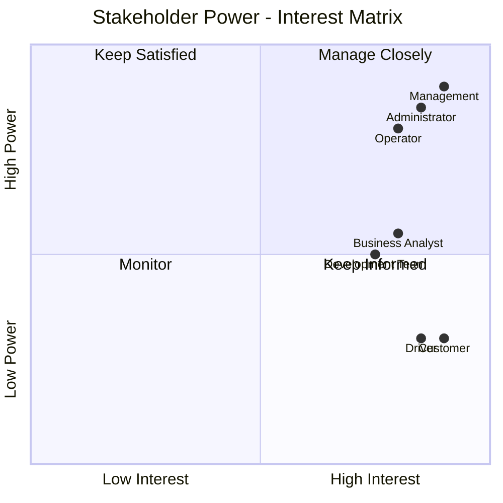

---

# B3 – Chuyển yêu cầu khách hàng thành Business Goals

> Quy ước: mục tiêu nghiệp vụ dùng mã **BG** để tránh nhầm với Business Requirement (BR).

| ID | Yêu cầu khách hàng | Business Goal |
|---|---|---|
| BG-01 | Khách hàng cần sử dụng hệ thống đặt xe thuận tiện. | Xây dựng quy trình đặt xe đơn giản và dễ sử dụng. |
| BG-02 | Khách hàng muốn tự chọn loại xe. | Cho phép Customer chủ động lựa chọn loại xe phù hợp. |
| BG-03 | Khách hàng muốn xem và lựa chọn tài xế. | Cho phép Customer lựa chọn Driver từ danh sách phù hợp. |
| BG-04 | Doanh nghiệp cần quản lý tài xế và phương tiện. | Quản lý tập trung hồ sơ, trạng thái, vị trí và phương tiện của Driver. |
| BG-05 | Tài xế cần tiếp nhận yêu cầu chuyến. | Hỗ trợ Driver nhận hoặc từ chối yêu cầu từ Customer. |
| BG-06 | Khách hàng cần biết tiến trình chuyến đi. | Cung cấp khả năng theo dõi trạng thái Trip. |
| BG-07 | Hệ thống cần kiểm soát quyền truy cập. | Đảm bảo mỗi vai trò chỉ sử dụng chức năng được phép. |
| BG-08 | MVP cần hoàn thành trong phạm vi phù hợp. | Ưu tiên quy trình đặt xe hoạt động ổn định thay vì tối ưu tài xế. |

---

# B4 – Phạm vi phát triển MVP

## 5.1. Module chính

### M-01 – Quản lý khách hàng

Bao gồm:

- Đăng ký Customer.
- Đăng nhập/đăng xuất.
- Xem và cập nhật hồ sơ.
- Tạo yêu cầu đặt xe.
- Chọn loại xe.
- Xem danh sách Driver phù hợp.
- Chọn Driver.
- Theo dõi chuyến.
- Xem lịch sử chuyến.

### M-02 – Quản lý tài xế

Bao gồm:

- Quản lý hồ sơ Driver.
- Quản lý trạng thái Driver.
- Cập nhật vị trí.
- Xem phương tiện.
- Tiếp nhận yêu cầu chuyến.
- Accept/Reject yêu cầu.
- Cập nhật trạng thái Trip.
- Xem lịch sử chuyến.

## 5.2. Nguyên tắc MVP

Trong giai đoạn MVP, hệ thống **không cần tìm tài xế tốt nhất**. Hệ thống chỉ cần xác định danh sách Driver đáp ứng điều kiện cơ bản như đang `AVAILABLE`, có loại xe phù hợp và có thể nhận chuyến. Customer tự lựa chọn Driver.

## 5.3. Ngoài phạm vi MVP

- AI/ML Driver Matching.
- Advanced Driver Ranking.
- Dynamic Pricing.
- Scheduled/Recurring Booking.
- Promotion/Voucher/Loyalty.
- Ride Sharing.
- Advanced Reporting/Analytics.
- Payment Gateway.
- Recommendation System.

---

# B5 – Business Requirements

| ID | Business Requirement |
|---|---|
| BR-01 | Hệ thống phải hỗ trợ quản lý tài khoản và hồ sơ Customer. |
| BR-02 | Hệ thống phải hỗ trợ quản lý hồ sơ, trạng thái, vị trí và phương tiện của Driver. |
| BR-03 | Customer phải có khả năng tạo yêu cầu đặt xe bằng cách cung cấp điểm đón và điểm đến. |
| BR-04 | Customer phải có khả năng xem và lựa chọn loại xe phù hợp. |
| BR-05 | Hệ thống phải hiển thị các Driver đáp ứng điều kiện cơ bản để Customer lựa chọn. |
| BR-06 | Customer phải có khả năng lựa chọn Driver và gửi yêu cầu chuyến đến Driver đó. |
| BR-07 | Driver phải có khả năng Accept hoặc Reject yêu cầu chuyến. |
| BR-08 | Hệ thống phải quản lý quá trình thực hiện Trip và cho phép Customer theo dõi trạng thái. |
| BR-09 | Hệ thống phải lưu Trip đã hoàn thành để Customer và Driver có thể xem lịch sử. |

---

# B6 – Mô hình hóa nghiệp vụ

Mỗi Business Requirement chính được ánh xạ thành một Business Process.

| Process | Business Requirement | Tên quy trình |
|---|---|---|
| BP-01 | BR-01 | Customer Account Management |
| BP-02 | BR-02 | Driver Management |
| BP-03 | BR-03 | Create Ride Request |
| BP-04 | BR-04 | Select Vehicle Type |
| BP-05 | BR-05 | View Available Drivers |
| BP-06 | BR-06 | Select Driver |
| BP-07 | BR-07 | Driver Responds to Trip Offer |
| BP-08 | BR-08 | Trip Execution |
| BP-09 | BR-09 | Trip History |

## 7.1. BP-01 – Customer Account Management

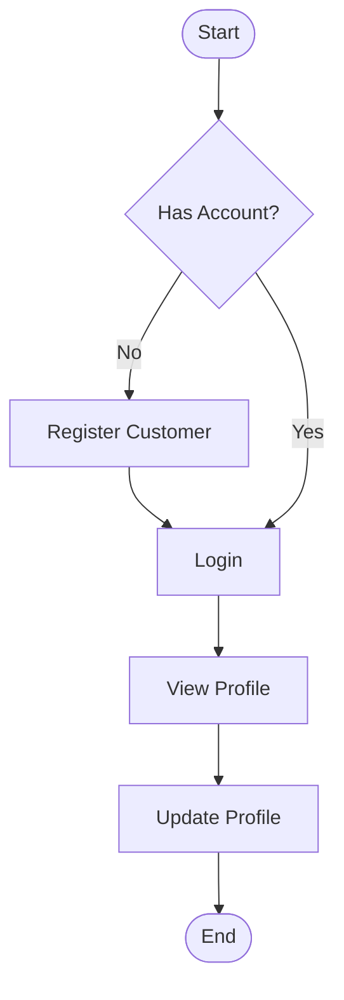

## 7.2. BP-02 – Driver Management

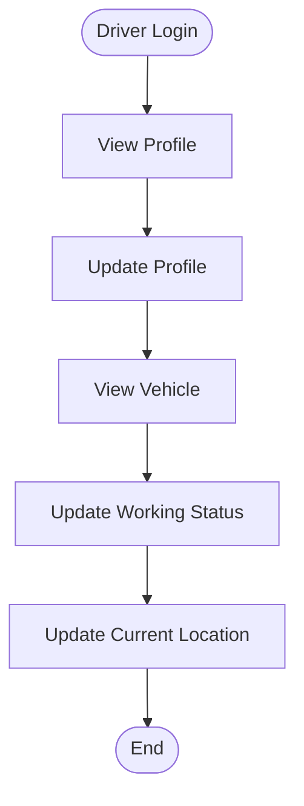

## 7.3. BP-03 – Create Ride Request

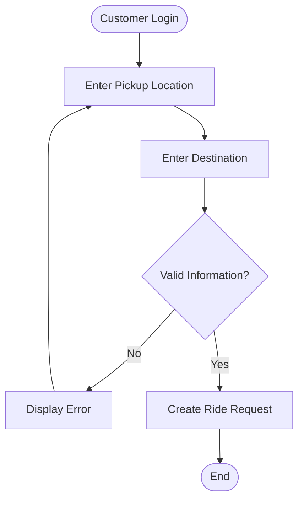

## 7.4. BP-04 – Select Vehicle Type

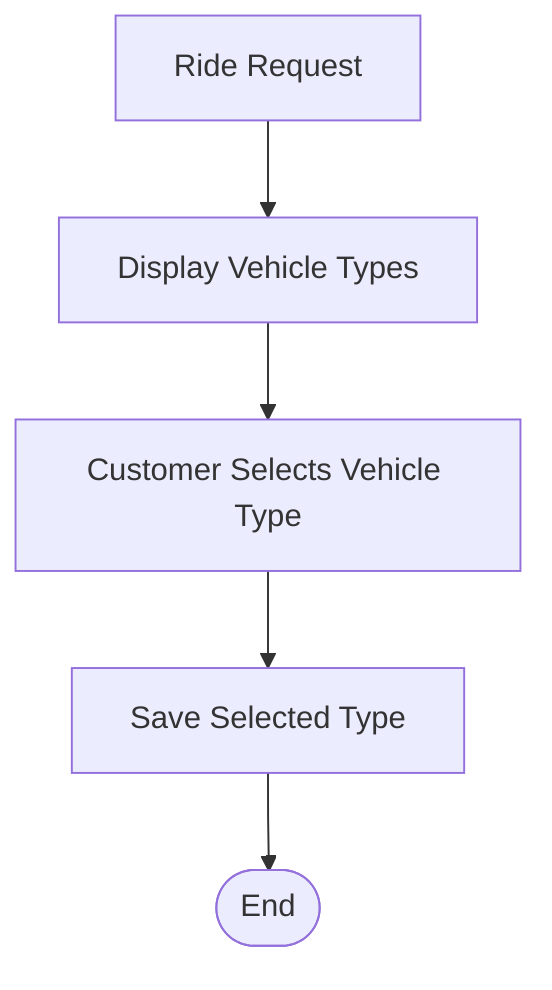

## 7.5. BP-05 – View Available Drivers

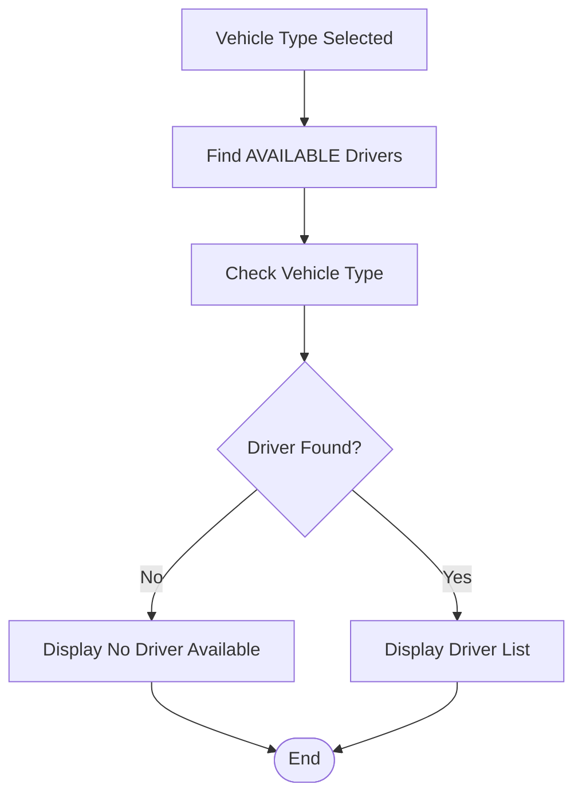

## 7.6. BP-06 – Select Driver

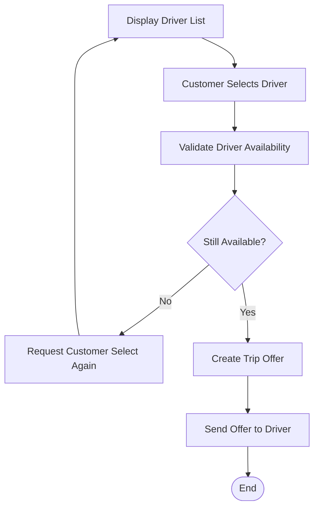

## 7.7. BP-07 – Driver Responds to Trip Offer

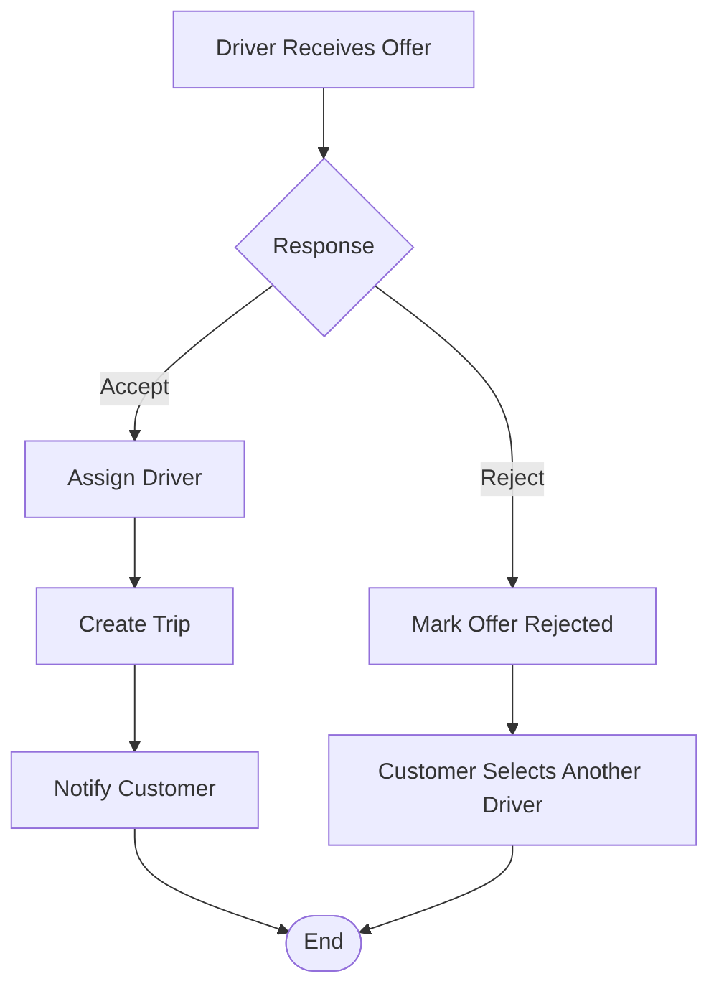

## 7.8. BP-08 – Trip Execution

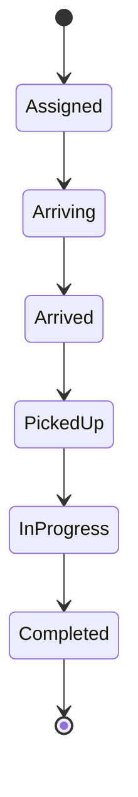

## 7.9. BP-09 – Trip History

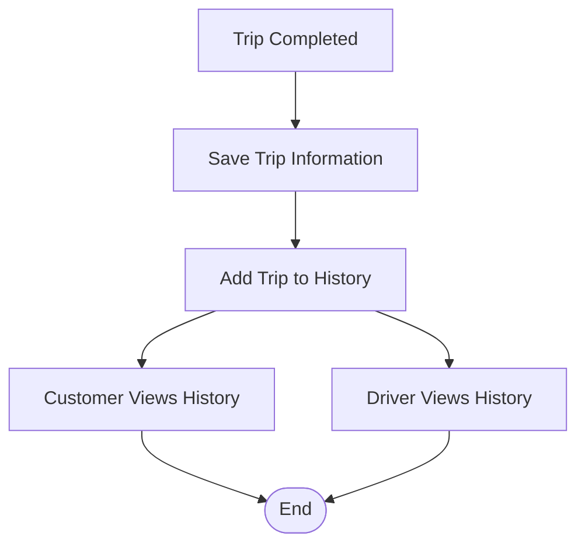

## 7.10. Quy trình tổng thể

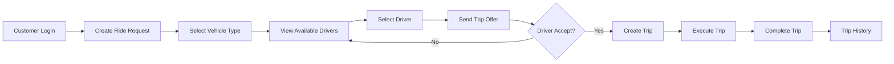

---

# B7 – Functional Requirements

## FR-01 – Customer Account

| ID | Functional Requirement |
|---|---|
| FR-01.01 | Hệ thống cho phép Customer đăng ký tài khoản. |
| FR-01.02 | Hệ thống cho phép người dùng đăng nhập. |
| FR-01.03 | Hệ thống cho phép người dùng đăng xuất. |
| FR-01.04 | Hệ thống cho phép Customer xem hồ sơ. |
| FR-01.05 | Hệ thống cho phép Customer cập nhật hồ sơ. |

## FR-02 – Driver Management

| ID | Functional Requirement |
|---|---|
| FR-02.01 | Hệ thống cho phép Driver xem hồ sơ. |
| FR-02.02 | Hệ thống cho phép Driver cập nhật hồ sơ. |
| FR-02.03 | Hệ thống cho phép Driver cập nhật trạng thái hoạt động. |
| FR-02.04 | Hệ thống cho phép Driver cập nhật vị trí hiện tại. |
| FR-02.05 | Hệ thống cho phép Driver xem thông tin phương tiện. |

## FR-03 – Ride Request

| ID | Functional Requirement |
|---|---|
| FR-03.01 | Customer có thể nhập điểm đón. |
| FR-03.02 | Customer có thể nhập điểm đến. |
| FR-03.03 | Hệ thống kiểm tra dữ liệu yêu cầu đặt xe. |
| FR-03.04 | Hệ thống tạo yêu cầu đặt xe khi dữ liệu hợp lệ. |

## FR-04 – Vehicle Type

| ID | Functional Requirement |
|---|---|
| FR-04.01 | Hệ thống hiển thị danh sách loại xe. |
| FR-04.02 | Customer có thể lựa chọn một loại xe. |

## FR-05 – Available Drivers

| ID | Functional Requirement |
|---|---|
| FR-05.01 | Hệ thống xác định Driver đang AVAILABLE. |
| FR-05.02 | Hệ thống lọc Driver theo loại xe Customer đã chọn. |
| FR-05.03 | Hệ thống hiển thị danh sách Driver phù hợp cho Customer. |

## FR-06 – Driver Selection

| ID | Functional Requirement |
|---|---|
| FR-06.01 | Customer có thể chọn một Driver trong danh sách. |
| FR-06.02 | Hệ thống kiểm tra lại khả năng nhận chuyến của Driver. |
| FR-06.03 | Hệ thống tạo Trip Offer cho Driver được chọn. |
| FR-06.04 | Hệ thống gửi yêu cầu chuyến đến Driver. |

## FR-07 – Trip Offer

| ID | Functional Requirement |
|---|---|
| FR-07.01 | Driver có thể xem Trip Offer của mình. |
| FR-07.02 | Driver có thể Accept Trip Offer. |
| FR-07.03 | Driver có thể Reject Trip Offer. |
| FR-07.04 | Hệ thống tạo Trip khi Driver Accept. |
| FR-07.05 | Customer có thể chọn Driver khác khi Driver Reject. |

## FR-08 – Trip Management

| ID | Functional Requirement |
|---|---|
| FR-08.01 | Hệ thống cho phép Customer và Driver xem Trip. |
| FR-08.02 | Driver có thể cập nhật trạng thái Trip. |
| FR-08.03 | Hệ thống kiểm soát thứ tự chuyển trạng thái Trip. |
| FR-08.04 | Customer có thể theo dõi trạng thái Trip. |
| FR-08.05 | Hệ thống ghi nhận Trip Completed. |

## FR-09 – Trip History

| ID | Functional Requirement |
|---|---|
| FR-09.01 | Hệ thống lưu Trip sau khi hoàn thành. |
| FR-09.02 | Customer có thể xem lịch sử Trip của mình. |
| FR-09.03 | Driver có thể xem lịch sử Trip của mình. |

---

# B8 – Business Rules

| ID | Business Rule |
|---|---|
| RULE-01 | Người dùng phải đăng nhập trước khi sử dụng chức năng yêu cầu xác thực. |
| RULE-02 | Mỗi tài khoản phải có vai trò xác định. |
| RULE-03 | Customer phải cung cấp điểm đón và điểm đến trước khi tạo yêu cầu đặt xe. |
| RULE-04 | Customer phải chọn loại xe trước khi xem Driver phù hợp. |
| RULE-05 | Chỉ Driver ở trạng thái `AVAILABLE` mới xuất hiện trong danh sách có thể lựa chọn. |
| RULE-06 | Driver phải có loại phương tiện phù hợp với loại xe Customer lựa chọn. |
| RULE-07 | Customer là người lựa chọn Driver trong MVP. |
| RULE-08 | Một Driver không được thực hiện nhiều Trip cùng lúc. |
| RULE-09 | Driver chỉ được Accept/Reject Trip Offer được gửi cho chính mình. |
| RULE-10 | Khi Driver Reject, Customer có thể lựa chọn Driver khác mà không cần nhập lại thông tin chuyến. |
| RULE-11 | Trip chỉ được tạo khi Driver Accept Trip Offer. |
| RULE-12 | Chỉ Driver được phân công mới được cập nhật trạng thái Trip. |
| RULE-13 | Trip phải chuyển trạng thái theo đúng thứ tự quy định. |
| RULE-14 | Trip Completed không được quay lại trạng thái trước đó. |
| RULE-15 | Người dùng chỉ được xem dữ liệu thuộc quyền truy cập của mình. |

## 9.1. Driver Status

```text
OFFLINE → ONLINE → AVAILABLE → BUSY
                      ↑          ↓
                      └──────────┘
```

## 9.2. Trip Status

```text
Assigned → Arriving → Arrived → PickedUp → InProgress → Completed
```

---

# B9 – Non-Functional Requirements

| ID | Category | Requirement |
|---|---|---|
| NFR-01 | Performance | Các thao tác thông thường phải phản hồi trong thời gian hợp lý. |
| NFR-02 | Performance | Việc lấy danh sách Driver không được làm gián đoạn quá trình đặt xe. |
| NFR-03 | Security | Người dùng phải được xác thực trước khi truy cập chức năng được bảo vệ. |
| NFR-04 | Security | Hệ thống phải kiểm soát quyền dựa trên vai trò. |
| NFR-05 | Security | Customer không được xem dữ liệu riêng của Customer khác. |
| NFR-06 | Security | Driver không được thao tác Trip không thuộc mình. |
| NFR-07 | Reliability | Dữ liệu Customer, Driver và Trip phải được lưu chính xác. |
| NFR-08 | Reliability | Trạng thái Driver và Trip phải nhất quán. |
| NFR-09 | Usability | Quy trình đặt xe phải đơn giản và dễ sử dụng. |
| NFR-10 | Usability | Thông báo lỗi phải rõ ràng và dễ hiểu. |
| NFR-11 | Maintainability | Hệ thống được chia module để thuận tiện bảo trì. |
| NFR-12 | Compatibility | Hệ thống hỗ trợ các trình duyệt web hiện đại. |

---

# B10 – ERD Entity

## 11.1. Danh sách Entity

| Entity | Mô tả |
|---|---|
| User | Thông tin đăng nhập và vai trò. |
| Customer | Hồ sơ Customer. |
| Driver | Hồ sơ, trạng thái và vị trí Driver. |
| Vehicle | Phương tiện của Driver. |
| VehicleType | Loại phương tiện Customer có thể lựa chọn. |
| RideRequest | Yêu cầu đặt xe của Customer. |
| TripOffer | Yêu cầu chuyến được gửi đến Driver. |
| Trip | Chuyến đi được tạo sau khi Driver Accept. |

## 11.2. ER Diagram

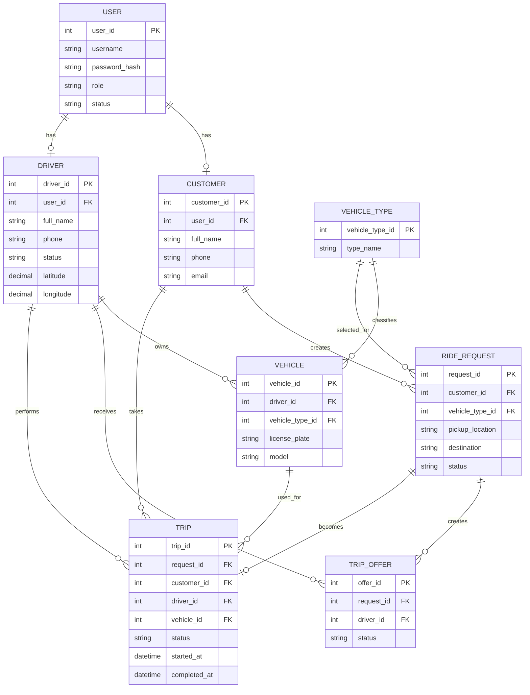

---

# B11 – Thiết kế Use Case

## 12.1. Danh sách Use Case

| ID | Use Case | Actor |
|---|---|---|
| UC-01 | Đăng ký tài khoản | Customer |
| UC-02 | Đăng nhập | Customer, Driver, Operator, Administrator |
| UC-03 | Đăng xuất | User |
| UC-04 | Xem hồ sơ | Customer, Driver |
| UC-05 | Cập nhật hồ sơ | Customer, Driver |
| UC-06 | Cập nhật trạng thái hoạt động | Driver |
| UC-07 | Cập nhật vị trí | Driver |
| UC-08 | Xem phương tiện | Driver |
| UC-09 | Tạo yêu cầu đặt xe | Customer |
| UC-10 | Lựa chọn loại xe | Customer |
| UC-11 | Xem danh sách Driver phù hợp | Customer |
| UC-12 | Lựa chọn Driver | Customer |
| UC-13 | Xem Trip Offer | Driver |
| UC-14 | Phản hồi Trip Offer | Driver |
| UC-15 | Xem Trip | Customer, Driver |
| UC-16 | Cập nhật trạng thái Trip | Driver |
| UC-17 | Xem lịch sử Trip | Customer, Driver |

## 12.2. Use Case Diagram

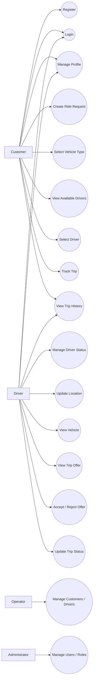

---

# B12 – Acceptance Criteria

| AC ID | Related FR | Acceptance Criteria |
|---|---|---|
| AC-01.01 | FR-01.01 | Given Customer nhập đầy đủ thông tin hợp lệ, when đăng ký, then hệ thống tạo tài khoản thành công. |
| AC-01.02 | FR-01.02 | Given tài khoản hợp lệ, when nhập đúng thông tin đăng nhập, then hệ thống cho phép truy cập. |
| AC-01.03 | FR-01.03 | Given người dùng đã đăng nhập, when logout, then phiên đăng nhập kết thúc. |
| AC-01.04 | FR-01.04 | Given Customer đã đăng nhập, when xem hồ sơ, then hệ thống hiển thị đúng hồ sơ của Customer. |
| AC-01.05 | FR-01.05 | Given dữ liệu cập nhật hợp lệ, when lưu, then hồ sơ được cập nhật. |
| AC-02.01 | FR-02.01 | Driver đã đăng nhập có thể xem đúng hồ sơ của mình. |
| AC-02.02 | FR-02.02 | Driver có thể lưu các thay đổi hồ sơ hợp lệ. |
| AC-02.03 | FR-02.03 | Driver có thể chuyển sang trạng thái hợp lệ theo Business Rules. |
| AC-02.04 | FR-02.04 | Vị trí hợp lệ của Driver được hệ thống ghi nhận. |
| AC-02.05 | FR-02.05 | Driver xem được phương tiện thuộc tài khoản của mình. |
| AC-03.01 | FR-03.01 | Hệ thống nhận điểm đón hợp lệ của Customer. |
| AC-03.02 | FR-03.02 | Hệ thống nhận điểm đến hợp lệ của Customer. |
| AC-03.03 | FR-03.03 | Dữ liệu thiếu/sai bị từ chối và hiển thị lỗi phù hợp. |
| AC-03.04 | FR-03.04 | Khi dữ liệu hợp lệ, hệ thống tạo Ride Request thành công. |
| AC-04.01 | FR-04.01 | Customer xem được các Vehicle Type đang được hỗ trợ. |
| AC-04.02 | FR-04.02 | Customer có thể chọn một Vehicle Type hợp lệ. |
| AC-05.01 | FR-05.01 | Danh sách lựa chọn chỉ chứa Driver đang AVAILABLE. |
| AC-05.02 | FR-05.02 | Driver hiển thị có Vehicle Type phù hợp với lựa chọn của Customer. |
| AC-05.03 | FR-05.03 | Customer xem được danh sách Driver đáp ứng điều kiện. |
| AC-06.01 | FR-06.01 | Customer có thể chọn một Driver từ danh sách hợp lệ. |
| AC-06.02 | FR-06.02 | Driver không còn AVAILABLE sẽ không được gửi Trip Offer mới. |
| AC-06.03 | FR-06.03 | Khi Driver hợp lệ, hệ thống tạo Trip Offer. |
| AC-06.04 | FR-06.04 | Trip Offer được gắn đúng Customer/Ride Request và Driver. |
| AC-07.01 | FR-07.01 | Driver chỉ xem được Trip Offer gửi cho mình. |
| AC-07.02 | FR-07.02 | Khi Driver Accept offer hợp lệ, hệ thống ghi nhận ACCEPTED. |
| AC-07.03 | FR-07.03 | Khi Driver Reject, hệ thống ghi nhận REJECTED. |
| AC-07.04 | FR-07.04 | Trip chỉ được tạo sau khi Driver Accept. |
| AC-07.05 | FR-07.05 | Sau Reject, Customer có thể chọn Driver khác mà không nhập lại Ride Request. |
| AC-08.01 | FR-08.01 | Customer và Driver liên quan xem được đúng thông tin Trip. |
| AC-08.02 | FR-08.02 | Driver được phân công có thể cập nhật trạng thái Trip. |
| AC-08.03 | FR-08.03 | Chuyển trạng thái sai thứ tự bị hệ thống từ chối. |
| AC-08.04 | FR-08.04 | Customer xem được trạng thái Trip hiện tại. |
| AC-08.05 | FR-08.05 | Khi trạng thái chuyển Completed, Trip được ghi nhận hoàn thành. |
| AC-09.01 | FR-09.01 | Trip Completed được lưu vào lịch sử. |
| AC-09.02 | FR-09.02 | Customer chỉ xem lịch sử Trip thuộc mình. |
| AC-09.03 | FR-09.03 | Driver chỉ xem lịch sử Trip mình đã thực hiện. |

---

# B13 – Requirement Traceability Matrix

| BG | BR | BP | FR | UC | AC |
|---|---|---|---|---|---|
| BG-01 | BR-01 | BP-01 | FR-01.01 → FR-01.05 | UC-01 → UC-05 | AC-01.01 → AC-01.05 |
| BG-04 | BR-02 | BP-02 | FR-02.01 → FR-02.05 | UC-04 → UC-08 | AC-02.01 → AC-02.05 |
| BG-01 | BR-03 | BP-03 | FR-03.01 → FR-03.04 | UC-09 | AC-03.01 → AC-03.04 |
| BG-02 | BR-04 | BP-04 | FR-04.01 → FR-04.02 | UC-10 | AC-04.01 → AC-04.02 |
| BG-03 | BR-05 | BP-05 | FR-05.01 → FR-05.03 | UC-11 | AC-05.01 → AC-05.03 |
| BG-03 | BR-06 | BP-06 | FR-06.01 → FR-06.04 | UC-12 | AC-06.01 → AC-06.04 |
| BG-05 | BR-07 | BP-07 | FR-07.01 → FR-07.05 | UC-13, UC-14 | AC-07.01 → AC-07.05 |
| BG-06 | BR-08 | BP-08 | FR-08.01 → FR-08.05 | UC-15, UC-16 | AC-08.01 → AC-08.05 |
| BG-06 | BR-09 | BP-09 | FR-09.01 → FR-09.03 | UC-17 | AC-09.01 → AC-09.03 |

## 14.1. Chuỗi truy vết

```text
Customer Requirement
        ↓
Business Goal (BG)
        ↓
Business Requirement (BR)
        ↓
Business Process (BP)
        ↓
Functional Requirement (FR)
        ↓
Use Case (UC)
        ↓
Acceptance Criteria (AC)
```

Bảng truy vết giúp kiểm tra rằng mỗi chức năng được phát triển đều bắt nguồn từ nhu cầu nghiệp vụ và có tiêu chí nghiệm thu tương ứng.

---
