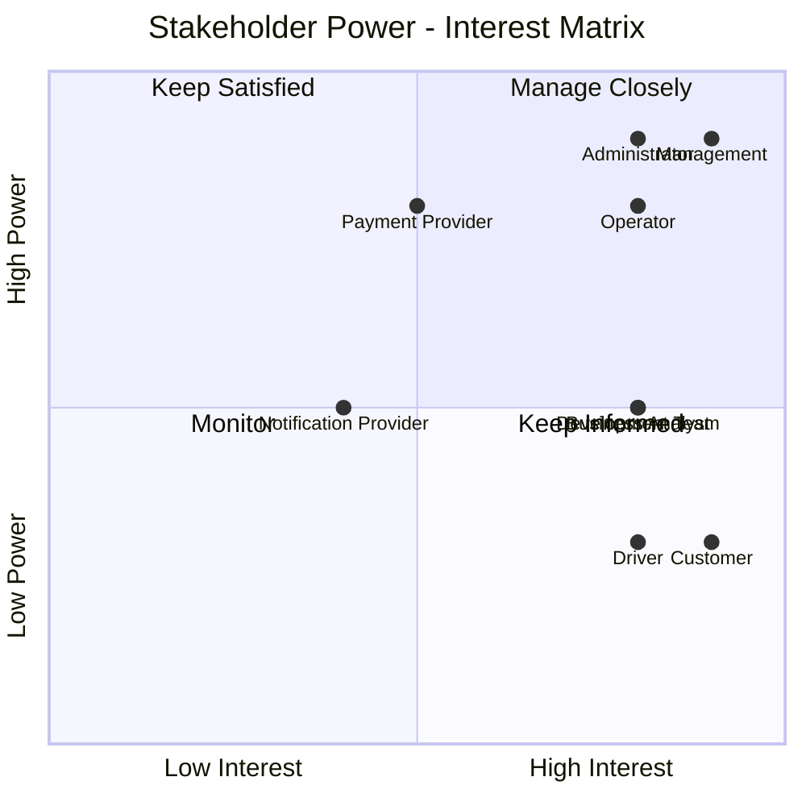
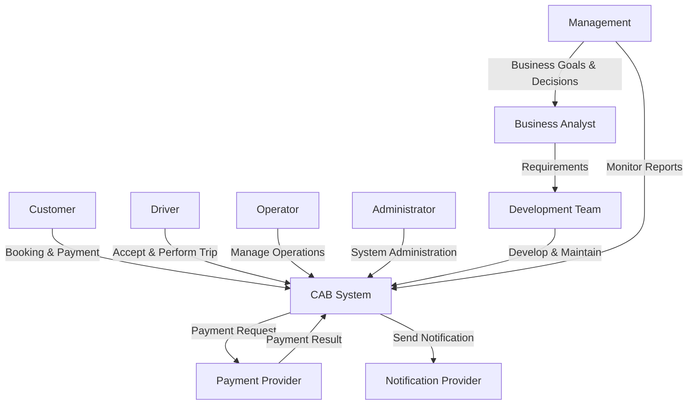
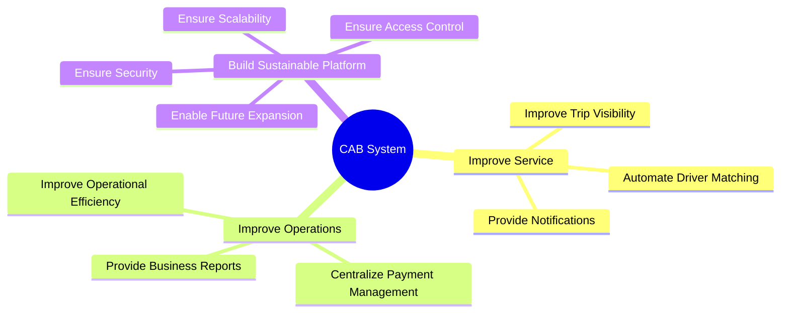

# 2. Stakeholder Analysis

## 2.1. Identified Stakeholders

Các bên liên quan (Stakeholders) của hệ thống CAB được xác định như sau:

| Stakeholder                   | Vai trò                                                                                                |
| ----------------------------- | ------------------------------------------------------------------------------------------------------ |
| Customer (Khách hàng)         | Sử dụng hệ thống để đặt xe, theo dõi chuyến đi, thanh toán và đánh giá tài xế.                         |
| Driver (Tài xế)               | Nhận và thực hiện chuyến đi, cập nhật trạng thái hoạt động và vị trí.                                  |
| Operator (Nhân viên vận hành) | Quản lý khách hàng, tài xế, phương tiện và hỗ trợ xử lý các vấn đề phát sinh trong quá trình vận hành. |
| Administrator                 | Quản lý hệ thống, phân quyền người dùng và kiểm soát các chức năng quản trị.                           |
| Management (Ban lãnh đạo)     | Theo dõi hoạt động kinh doanh, doanh thu và các báo cáo về hiệu quả hoạt động của hệ thống.            |
| Payment Provider              | Cung cấp dịch vụ xử lý thanh toán điện tử cho hệ thống.                                                |
| Notification Provider         | Cung cấp dịch vụ gửi thông báo đến khách hàng và tài xế.                                               |
| Development Team              | Phát triển, kiểm thử, triển khai và bảo trì hệ thống CAB.                                              |
| Business Analyst              | Thu thập, phân tích và làm rõ yêu cầu giữa khách hàng và nhóm phát triển.                              |

---

## 2.2. Stakeholder Matrix

Stakeholder Matrix được xây dựng dựa trên hai tiêu chí:

* **Power:** Mức độ ảnh hưởng đến dự án.
* **Interest:** Mức độ quan tâm đến hệ thống.

| Stakeholder           | Power  | Interest | Management Strategy |
| --------------------- | ------ | -------- | ------------------- |
| Management            | High   | High     | Manage Closely      |
| Operator              | High   | High     | Manage Closely      |
| Customer              | Low    | High     | Keep Informed       |
| Driver                | Low    | High     | Keep Informed       |
| Administrator         | High   | High     | Manage Closely      |
| Payment Provider      | High   | Medium   | Keep Satisfied      |
| Notification Provider | Medium | Medium   | Monitor             |
| Development Team      | Medium | High     | Keep Informed       |
| Business Analyst      | Medium | High     | Keep Informed       |

---

## 2.3. Power – Interest Matrix

---

## 2.4. Stakeholder Relationship Diagram

---

## 2.5. Stakeholder Classification

### Primary Stakeholders

Các Stakeholder trực tiếp sử dụng hệ thống:

* Customer
* Driver
* Operator
* Administrator

### Key Stakeholders

Các Stakeholder có ảnh hưởng lớn đến dự án:

* Management
* Business Analyst
* Development Team

### External Stakeholders

Các bên cung cấp dịch vụ bên ngoài:

* Payment Provider
* Notification Provider

# 4. Business Goals

## 4.1. Business Goal Identification

Dựa trên yêu cầu và kỳ vọng của khách hàng, các mục tiêu nghiệp vụ của dự án CAB System được xác định như sau:

| ID    | Customer Requirement                                                    | Business Goal                                                                   |
| ----- | ----------------------------------------------------------------------- | ------------------------------------------------------------------------------- |
| BG-01 | Hệ thống hiện tại phân công tài xế chủ yếu thủ công.                    | Tự động hóa quá trình tìm kiếm và phân công tài xế phù hợp.                     |
| BG-02 | Khách hàng khó theo dõi trạng thái chuyến đi.                           | Nâng cao khả năng theo dõi và quản lý trạng thái chuyến đi theo thời gian thực. |
| BG-03 | Thông tin thanh toán chưa được quản lý tập trung.                       | Xây dựng cơ chế tính cước và quản lý thanh toán tập trung, an toàn.             |
| BG-04 | Bộ phận vận hành gặp khó khăn trong việc quản lý và mở rộng hệ thống.   | Nâng cao hiệu quả quản lý và vận hành hoạt động đặt xe.                         |
| BG-05 | Hệ thống cần phục vụ số lượng lớn khách hàng và tài xế.                 | Xây dựng hệ thống có khả năng mở rộng và đáp ứng nhu cầu tăng trưởng.           |
| BG-06 | Khách hàng và tài xế cần được thông báo về các sự kiện quan trọng.      | Cung cấp cơ chế thông báo kịp thời trong quá trình sử dụng dịch vụ.             |
| BG-07 | Ban lãnh đạo cần theo dõi số chuyến, doanh thu và hiệu quả tài xế.      | Cung cấp dữ liệu và báo cáo hỗ trợ quản lý và ra quyết định.                    |
| BG-08 | Dữ liệu cá nhân, vị trí và giao dịch cần được bảo vệ.                   | Đảm bảo an toàn và bảo mật thông tin trong hệ thống.                            |
| BG-09 | Các chức năng quản trị cần được kiểm soát quyền truy cập.               | Đảm bảo kiểm soát và phân quyền phù hợp cho người dùng hệ thống.                |
| BG-10 | Hệ thống cần có khả năng phát triển thêm các tính năng trong tương lai. | Xây dựng nền tảng linh hoạt, dễ bảo trì và hỗ trợ mở rộng trong tương lai.      |

---

## 4.2. Detailed Business Goals

### BG-01: Automate Driver Matching and Assignment

Tự động hóa quá trình tìm kiếm, lựa chọn và phân công tài xế phù hợp nhằm giảm sự phụ thuộc vào việc điều phối thủ công và nâng cao hiệu quả phục vụ khách hàng.

---

### BG-02: Improve Trip Visibility

Cung cấp khả năng theo dõi trạng thái chuyến đi và thông tin liên quan, giúp khách hàng và bộ phận vận hành dễ dàng kiểm soát quá trình thực hiện chuyến đi.

---

### BG-03: Centralize Fare and Payment Management

Xây dựng cơ chế tính cước và quản lý thanh toán tập trung, hỗ trợ nhiều phương thức thanh toán và đảm bảo an toàn thông tin giao dịch.

---

### BG-04: Improve Operational Efficiency

Cung cấp công cụ hỗ trợ bộ phận vận hành quản lý khách hàng, tài xế, phương tiện và chuyến đi, từ đó nâng cao hiệu quả hoạt động của doanh nghiệp.

---

### BG-05: Support System Scalability

Xây dựng hệ thống có khả năng đáp ứng số lượng lớn khách hàng và tài xế, đồng thời cho phép các thành phần được mở rộng khi nhu cầu sử dụng tăng.

---

### BG-06: Provide Timely Notifications

Cung cấp cơ chế thông báo kịp thời cho khách hàng và tài xế về các sự kiện quan trọng trong quá trình đặt và thực hiện chuyến đi.

---

### BG-07: Support Business Monitoring and Decision Making

Cung cấp các báo cáo và dữ liệu cần thiết về hoạt động kinh doanh, doanh thu, chuyến đi và hiệu quả tài xế nhằm hỗ trợ ban lãnh đạo theo dõi và ra quyết định.

---

### BG-08: Ensure Data Security

Đảm bảo thông tin cá nhân, dữ liệu vị trí và dữ liệu giao dịch được bảo vệ, đồng thời hạn chế các rủi ro liên quan đến bảo mật thông tin.

---

### BG-09: Ensure Access Control

Thiết lập cơ chế phân quyền phù hợp nhằm đảm bảo người dùng chỉ có thể truy cập và thực hiện các chức năng được cho phép.

---

### BG-10: Enable Future System Expansion

Xây dựng nền tảng có kiến trúc linh hoạt, cho phép bổ sung dịch vụ, phương thức thanh toán, nhà cung cấp thông báo và các chức năng mới mà không cần xây dựng lại toàn bộ hệ thống.

---

## 4.3. Business Goal Hierarchy

