# SRS – CAB System

# 1. Stakeholder Analysis

## 1.1. Mục đích

Stakeholder là các cá nhân, nhóm hoặc tổ chức có ảnh hưởng đến dự án CAB System hoặc chịu ảnh hưởng từ hoạt động của hệ thống.

Dựa trên yêu cầu của khách hàng, các stakeholder được xác định gồm các nhóm nội bộ, bên ngoài và các hệ thống bên thứ ba.

---

## 1.2. Danh sách Stakeholder và Vai trò

| STT | Stakeholder | Loại | Vai trò |
|---:|---|---|---|
| 1 | Ban giám đốc | Internal | Định hướng dự án, phê duyệt ngân sách và theo dõi hiệu quả kinh doanh |
| 2 | Khách hàng | External | Đăng ký, đặt xe, theo dõi chuyến, thanh toán và đánh giá tài xế |
| 3 | Tài xế | External | Nhận chuyến, thực hiện chuyến và cập nhật trạng thái chuyến |
| 4 | Nhân viên vận hành | Internal | Quản lý khách hàng, tài xế, phương tiện và chuyến đi |
| 5 | Quản trị viên hệ thống | Internal | Quản lý tài khoản, phân quyền, cấu hình và bảo mật hệ thống |
| 6 | Bộ phận kế toán / tài chính | Internal | Quản lý giao dịch, doanh thu và đối soát thanh toán |
| 7 | Bộ phận chăm sóc khách hàng | Internal | Hỗ trợ khách hàng, xử lý khiếu nại và sự cố |
| 8 | Business Analyst | Internal | Thu thập, phân tích và làm rõ yêu cầu nghiệp vụ |
| 9 | Đội phát triển phần mềm | Internal | Thiết kế, xây dựng và bảo trì hệ thống |
| 10 | QA / Tester | Internal | Kiểm thử và đảm bảo chất lượng hệ thống |
| 11 | DevOps / System Administrator | Internal | Triển khai, giám sát và đảm bảo hệ thống hoạt động ổn định |
| 12 | Nhà cung cấp thanh toán | External | Xử lý các giao dịch thanh toán điện tử |
| 13 | Nhà cung cấp bản đồ / GPS | External | Cung cấp vị trí, khoảng cách và hỗ trợ tính ETA |
| 14 | Nhà cung cấp dịch vụ thông báo | External | Gửi thông báo qua Push Notification, SMS hoặc Email |

---

# 2. Stakeholder Matrix

## 2.1. Tiêu chí đánh giá

Stakeholder được phân loại dựa trên hai tiêu chí:

- **Power (Mức độ ảnh hưởng):** Khả năng tác động đến quyết định, phạm vi và kết quả dự án.
- **Interest (Mức độ quan tâm):** Mức độ quan tâm đến hoạt động và kết quả của hệ thống.

Mỗi stakeholder được phân loại vào một trong bốn nhóm:

| Nhóm | Power | Interest | Chiến lược |
|---|---|---|---|
| Manage Closely | Cao | Cao | Quản lý chặt chẽ, thường xuyên trao đổi |
| Keep Satisfied | Cao | Thấp | Đảm bảo hài lòng và cập nhật khi cần |
| Keep Informed | Thấp | Cao | Cung cấp thông tin thường xuyên |
| Monitor | Thấp | Thấp | Theo dõi và cập nhật khi cần |

---

## 2.2. Phân loại Stakeholder

| Stakeholder | Power | Interest | Nhóm | Chiến lược |
|---|---|---|---|---|
| Ban giám đốc | Cao | Cao | Manage Closely | Báo cáo tiến độ, rủi ro và kết quả dự án |
| Nhân viên vận hành | Cao | Cao | Manage Closely | Tham gia phân tích và xác nhận quy trình nghiệp vụ |
| Khách hàng | Thấp | Cao | Keep Informed | Thu thập phản hồi và cập nhật tính năng |
| Tài xế | Thấp | Cao | Keep Informed | Thu thập phản hồi và hướng dẫn sử dụng |
| Quản trị viên hệ thống | Cao | Cao | Manage Closely | Tham gia thiết kế quyền, bảo mật và vận hành |
| Kế toán / Tài chính | Cao | Cao | Manage Closely | Xác nhận yêu cầu thanh toán và báo cáo tài chính |
| Chăm sóc khách hàng | Thấp | Cao | Keep Informed | Thu thập yêu cầu hỗ trợ và phản hồi |
| Business Analyst | Cao | Cao | Manage Closely | Phân tích, quản lý và xác nhận yêu cầu |
| Đội phát triển phần mềm | Cao | Cao | Manage Closely | Phối hợp triển khai giải pháp kỹ thuật |
| QA / Tester | Thấp | Cao | Keep Informed | Cập nhật yêu cầu và tiêu chí kiểm thử |
| DevOps / System Administrator | Cao | Cao | Manage Closely | Phối hợp triển khai, giám sát và mở rộng hệ thống |
| Nhà cung cấp thanh toán | Cao | Thấp | Keep Satisfied | Quản lý tích hợp và đảm bảo dịch vụ ổn định |
| Nhà cung cấp bản đồ / GPS | Thấp | Thấp | Monitor | Theo dõi chất lượng dịch vụ |
| Nhà cung cấp thông báo | Thấp | Thấp | Monitor | Theo dõi khả năng gửi thông báo |

---

## 2.3. Stakeholder Power / Interest Matrix

```mermaid
quadrantChart
    title Stakeholder Power / Interest Matrix
    x-axis "Low Interest" --> "High Interest"
    y-axis "Low Power" --> "High Power"

    quadrant-1 "Manage Closely"
    quadrant-2 "Keep Satisfied"
    quadrant-3 "Monitor"
    quadrant-4 "Keep Informed"

    "Ban giám đốc": [0.85, 0.90]
    "Nhân viên vận hành": [0.85, 0.80]
    "Quản trị viên hệ thống": [0.80, 0.85]
    "Kế toán / Tài chính": [0.75, 0.75]
    "Business Analyst": [0.90, 0.85]
    "Đội phát triển": [0.85, 0.75]
    "DevOps": [0.80, 0.80]

    "Khách hàng": [0.85, 0.30]
    "Tài xế": [0.80, 0.25]
    "Chăm sóc khách hàng": [0.75, 0.30]
    "QA / Tester": [0.70, 0.25]

    "Nhà cung cấp thanh toán": [0.25, 0.75]
    "Nhà cung cấp bản đồ / GPS": [0.25, 0.30]
    "Nhà cung cấp thông báo": [0.20, 0.25]
# Business Goals

## 1. Mục đích

Business Goals được xây dựng dựa trên yêu cầu của khách hàng nhằm xác định các mục tiêu nghiệp vụ chính mà hệ thống CAB System cần đạt được.

Các Business Goals tập trung vào giá trị mà hệ thống mang lại cho doanh nghiệp, khách hàng, tài xế và bộ phận vận hành.

---

## 2. Danh sách Business Goals

| Mã | Business Goal | Mô tả |
|---|---|---|
| BG-01 | Xây dựng nền tảng đặt xe trực tuyến | Xây dựng nền tảng CAB System cho phép khách hàng đặt xe trực tuyến một cách thuận tiện, nhanh chóng và dễ sử dụng. |
| BG-02 | Tự động hóa quy trình tìm kiếm và phân công tài xế | Tự động tìm kiếm và phân công tài xế phù hợp dựa trên vị trí, trạng thái sẵn sàng và các tiêu chí vận hành. |
| BG-03 | Nâng cao khả năng theo dõi và quản lý chuyến đi | Cho phép khách hàng, tài xế và nhân viên vận hành theo dõi trạng thái chuyến đi một cách rõ ràng và kịp thời. |
| BG-04 | Quản lý tính cước và thanh toán | Cung cấp cơ chế tính cước và thanh toán tập trung, hỗ trợ tiền mặt và thanh toán điện tử một cách an toàn. |
| BG-05 | Cải thiện hệ thống thông báo | Cung cấp thông báo kịp thời cho khách hàng và tài xế về các sự kiện quan trọng trong quá trình đặt và thực hiện chuyến. |
| BG-06 | Nâng cao hiệu quả vận hành | Cung cấp công cụ quản trị giúp nhân viên vận hành quản lý khách hàng, tài xế, phương tiện và chuyến đi. |
| BG-07 | Cung cấp báo cáo và dữ liệu quản lý | Cung cấp dữ liệu và báo cáo về chuyến đi, doanh thu, tỷ lệ hoàn thành, tỷ lệ hủy và hiệu quả tài xế để hỗ trợ ra quyết định. |
| BG-08 | Đảm bảo tính ổn định và khả năng mở rộng | Đảm bảo hệ thống hoạt động ổn định khi nhu cầu tăng cao và các thành phần có thể mở rộng độc lập. |
| BG-09 | Đảm bảo an toàn và bảo mật dữ liệu | Bảo vệ thông tin cá nhân, thông tin phương tiện, dữ liệu vị trí và dữ liệu giao dịch, đồng thời kiểm soát quyền truy cập. |
| BG-10 | Xây dựng nền tảng linh hoạt cho tương lai | Cho phép hệ thống dễ dàng bổ sung dịch vụ, phương thức thanh toán, nhà cung cấp thông báo và thay đổi thành phần kỹ thuật. |

---

# 3. Chi tiết Business Goals

## BG-01 – Xây dựng nền tảng đặt xe trực tuyến

### Mục tiêu

Xây dựng một nền tảng CAB System cho phép khách hàng sử dụng dịch vụ đặt xe trực tuyến một cách thuận tiện, nhanh chóng và dễ dàng.

### Yêu cầu liên quan

- Khách hàng có thể đăng ký tài khoản.
- Khách hàng có thể đăng nhập.
- Khách hàng có thể cập nhật thông tin cá nhân.
- Khách hàng có thể nhập điểm đón và điểm đến.
- Khách hàng có thể lựa chọn loại xe.
- Khách hàng có thể gửi yêu cầu đặt xe.
- Hệ thống có khả năng phục vụ số lượng lớn khách hàng và tài xế.

---

## BG-02 – Tự động hóa quy trình tìm kiếm và phân công tài xế

### Mục tiêu

Giảm sự phụ thuộc vào việc phân công tài xế thủ công bằng cách tự động tìm kiếm và lựa chọn tài xế phù hợp cho khách hàng.

### Yêu cầu liên quan

- Xác định tài xế phù hợp dựa trên vị trí.
- Kiểm tra trạng thái sẵn sàng của tài xế.
- Ưu tiên tài xế phù hợp và gần khách hàng.
- Tài xế có thể chấp nhận hoặc từ chối chuyến.
- Tự động tìm tài xế khác nếu tài xế được đề xuất không phản hồi hoặc từ chối.
- Không yêu cầu khách hàng tạo lại yêu cầu khi tài xế đầu tiên không nhận chuyến.
- Thông báo cho khách hàng khi không tìm được tài xế.

---

## BG-03 – Nâng cao khả năng theo dõi và quản lý chuyến đi

### Mục tiêu

Cung cấp khả năng theo dõi trạng thái chuyến đi cho khách hàng, tài xế và nhân viên vận hành nhằm tăng tính minh bạch và hiệu quả quản lý.

### Yêu cầu liên quan

- Khách hàng biết hệ thống đang tìm tài xế.
- Khách hàng biết tài xế đã nhận chuyến.
- Khách hàng biết thời gian dự kiến tài xế đến.
- Tài xế cập nhật trạng thái chuyến.
- Tài xế cập nhật trạng thái đã đến điểm đón.
- Tài xế cập nhật trạng thái đã đón khách.
- Tài xế cập nhật trạng thái đang di chuyển.
- Tài xế cập nhật trạng thái hoàn thành chuyến.
- Nhân viên vận hành có thể theo dõi các chuyến đang diễn ra.
- Hệ thống lưu thông tin vị trí của tài xế.

---

## BG-04 – Quản lý tính cước và thanh toán

### Mục tiêu

Xây dựng cơ chế tính cước và thanh toán tập trung, hỗ trợ nhiều phương thức thanh toán và đảm bảo an toàn dữ liệu thanh toán.

### Yêu cầu liên quan

- Tính số tiền khách hàng phải trả sau khi hoàn thành chuyến.
- Hỗ trợ thanh toán bằng tiền mặt.
- Hỗ trợ thanh toán điện tử.
- Tích hợp với nhà cung cấp thanh toán bên ngoài.
- Không lưu trực tiếp thông tin nhạy cảm của thẻ hoặc tài khoản thanh toán.
- Thông báo khi giao dịch thanh toán thành công.
- Thông báo khi giao dịch thanh toán thất bại.
- Cho phép xử lý lại thanh toán theo chính sách của doanh nghiệp.

---

## BG-05 – Cải thiện hệ thống thông báo

### Mục tiêu

Đảm bảo khách hàng và tài xế nhận được thông tin kịp thời về các sự kiện quan trọng trong quá trình đặt và thực hiện chuyến.

### Yêu cầu liên quan

- Thông báo khi yêu cầu đặt xe được tiếp nhận.
- Thông báo khi tài xế nhận chuyến.
- Thông báo khi tài xế đến điểm đón.
- Thông báo khi chuyến hoàn thành.
- Thông báo khi thanh toán có kết quả.
- Tài xế nhận thông báo về chuyến mới.
- Tài xế nhận thông báo khi có thay đổi liên quan đến chuyến.
- Có khả năng mở rộng thêm các kênh thông báo trong tương lai.

---

## BG-06 – Nâng cao hiệu quả vận hành

### Mục tiêu

Cung cấp giao diện và công cụ quản trị giúp nhân viên vận hành quản lý tập trung các hoạt động của hệ thống CAB.

### Yêu cầu liên quan

- Quản lý khách hàng.
- Quản lý tài xế.
- Quản lý phương tiện.
- Theo dõi các chuyến đang diễn ra.
- Kiểm tra trạng thái tài xế.
- Xử lý các trường hợp chuyến bị lỗi.
- Tra cứu lịch sử giao dịch.
- Phân quyền các chức năng quản trị.

---

## BG-07 – Cung cấp báo cáo và dữ liệu quản lý

### Mục tiêu

Cung cấp dữ liệu và báo cáo giúp ban lãnh đạo đánh giá hiệu quả kinh doanh và hoạt động vận hành của hệ thống.

### Yêu cầu liên quan

- Báo cáo số lượng chuyến.
- Báo cáo doanh thu.
- Báo cáo tỷ lệ chuyến hoàn thành.
- Báo cáo tỷ lệ chuyến hủy.
- Báo cáo hiệu quả hoạt động của tài xế.
- Cung cấp dữ liệu phục vụ việc ra quyết định của ban lãnh đạo.

---

## BG-08 – Đảm bảo tính ổn định và khả năng mở rộng

### Mục tiêu

Đảm bảo CAB System có thể hoạt động ổn định trong thời điểm nhu cầu tăng cao và có khả năng mở rộng khi số lượng người dùng và giao dịch tăng.

### Yêu cầu liên quan

- Hệ thống hoạt động ổn định khi nhu cầu tăng cao.
- Lỗi ở chức năng thanh toán không làm toàn bộ hệ thống ngừng hoạt động.
- Lỗi ở chức năng thông báo không làm toàn bộ hệ thống đặt xe ngừng hoạt động.
- Các thành phần có khả năng mở rộng độc lập.
- Chức năng mới có thể được triển khai từng phần.
- Hạn chế ảnh hưởng đến các chức năng đang hoạt động khi triển khai chức năng mới.

---

## BG-09 – Đảm bảo an toàn và bảo mật dữ liệu

### Mục tiêu

Đảm bảo thông tin người dùng, dữ liệu vị trí, thông tin phương tiện và dữ liệu giao dịch được bảo vệ và chỉ được truy cập bởi những đối tượng có quyền.

### Yêu cầu liên quan

- Khách hàng phải được xác thực trước khi sử dụng chức năng yêu cầu tài khoản.
- Tài xế phải được xác thực trước khi sử dụng chức năng yêu cầu tài khoản.
- Các chức năng quản trị phải được kiểm soát quyền truy cập.
- Bảo vệ thông tin cá nhân.
- Bảo vệ thông tin phương tiện.
- Bảo vệ dữ liệu vị trí.
- Bảo vệ dữ liệu giao dịch.
- Lưu vết các thao tác quan trọng.
- Hỗ trợ kiểm tra và điều tra khi xảy ra sự cố.

---

## BG-10 – Xây dựng nền tảng linh hoạt cho tương lai

### Mục tiêu

Xây dựng hệ thống CAB có kiến trúc linh hoạt để doanh nghiệp có thể mở rộng dịch vụ và thay đổi các thành phần kỹ thuật mà không cần xây dựng lại toàn bộ hệ thống.

### Yêu cầu liên quan

- Có thể bổ sung loại dịch vụ mới.
- Có thể thêm phương thức thanh toán.
- Có thể thêm nhà cung cấp thông báo.
- Có thể thay đổi một số thành phần kỹ thuật.
- Hạn chế việc phải xây dựng lại toàn bộ ứng dụng.
- Hỗ trợ phát triển hệ thống lâu dài.

À hiểu rồi 😄 Bạn muốn **chỉ lấy phần mã Markdown (`.md`)**, để copy vào `SRS.md`, không cần giải thích thêm.

 Copy nguyên khối này:

````
# BUSINESS GOALS

## 1. Danh sách Business Goals

| Mã | Business Goal | Mô tả |
|---|---|---|
| **BG-01** | Xây dựng nền tảng đặt xe trực tuyến | Xây dựng hệ thống CAB System cho phép khách hàng đặt xe trực tuyến thuận tiện, nhanh chóng và dễ sử dụng. |
| **BG-02** | Tự động hóa tìm kiếm và phân công tài xế | Tự động tìm kiếm và phân công tài xế phù hợp dựa trên vị trí, trạng thái sẵn sàng và các tiêu chí vận hành. |
| **BG-03** | Theo dõi và quản lý chuyến đi | Cho phép khách hàng, tài xế và nhân viên vận hành theo dõi trạng thái chuyến đi một cách rõ ràng và kịp thời. |
| **BG-04** | Quản lý tính cước và thanh toán | Cung cấp cơ chế tính cước và thanh toán tập trung, hỗ trợ tiền mặt và thanh toán điện tử an toàn. |
| **BG-05** | Cải thiện hệ thống thông báo | Cung cấp thông báo kịp thời cho khách hàng và tài xế về các sự kiện quan trọng trong quá trình đặt và thực hiện chuyến. |
| **BG-06** | Nâng cao hiệu quả vận hành | Cung cấp công cụ quản trị giúp nhân viên vận hành quản lý khách hàng, tài xế, phương tiện và chuyến đi. |
| **BG-07** | Cung cấp báo cáo và dữ liệu quản lý | Cung cấp dữ liệu về số lượng chuyến, doanh thu, tỷ lệ hoàn thành, tỷ lệ hủy và hiệu quả hoạt động của tài xế. |
| **BG-08** | Đảm bảo tính ổn định và khả năng mở rộng | Đảm bảo hệ thống hoạt động ổn định khi nhu cầu tăng cao và các thành phần có thể mở rộng độc lập. |
| **BG-09** | Đảm bảo an toàn và bảo mật dữ liệu | Bảo vệ thông tin cá nhân, phương tiện, dữ liệu vị trí và dữ liệu giao dịch, đồng thời kiểm soát quyền truy cập. |
| **BG-10** | Xây dựng nền tảng linh hoạt cho tương lai | Cho phép bổ sung dịch vụ, phương thức thanh toán, nhà cung cấp thông báo và thay đổi thành phần kỹ thuật. |

---

## 2. Chi tiết Business Goals

### BG-01 – Xây dựng nền tảng đặt xe trực tuyến

**Mục tiêu:**

Xây dựng nền tảng CAB System cho phép khách hàng đặt xe trực tuyến thuận tiện, nhanh chóng và dễ sử dụng.

**Yêu cầu liên quan:**

- Khách hàng có thể đăng ký tài khoản.
- Khách hàng có thể đăng nhập.
- Khách hàng có thể cập nhật thông tin cá nhân.
- Khách hàng có thể nhập điểm đón và điểm đến.
- Khách hàng có thể lựa chọn loại xe.
- Khách hàng có thể gửi yêu cầu đặt xe.
- Hệ thống có khả năng phục vụ số lượng lớn khách hàng và tài xế.

---

### BG-02 – Tự động hóa tìm kiếm và phân công tài xế

**Mục tiêu:**

Tự động tìm kiếm và phân công tài xế phù hợp, giảm sự phụ thuộc vào việc phân công thủ công.

**Yêu cầu liên quan:**

- Xác định tài xế phù hợp dựa trên vị trí.
- Kiểm tra trạng thái sẵn sàng của tài xế.
- Ưu tiên tài xế phù hợp và gần khách hàng.
- Tài xế có thể chấp nhận hoặc từ chối chuyến.
- Tiếp tục tìm tài xế khác nếu tài xế không phản hồi hoặc từ chối.
- Không yêu cầu khách hàng tạo lại yêu cầu.
- Thông báo cho khách hàng khi không tìm được tài xế.

---

### BG-03 – Theo dõi và quản lý chuyến đi

**Mục tiêu:**

Cung cấp khả năng theo dõi trạng thái chuyến đi cho khách hàng, tài xế và nhân viên vận hành.

**Yêu cầu liên quan:**

- Khách hàng biết hệ thống đang tìm tài xế.
- Khách hàng biết tài xế đã nhận chuyến.
- Khách hàng biết thời gian dự kiến tài xế đến.
- Tài xế có thể cập nhật trạng thái chuyến.
- Nhân viên vận hành có thể theo dõi chuyến đang diễn ra.
- Hệ thống lưu thông tin vị trí của tài xế.

---

### BG-04 – Quản lý tính cước và thanh toán

**Mục tiêu:**

Xây dựng cơ chế tính cước và thanh toán tập trung, hỗ trợ nhiều phương thức thanh toán và đảm bảo an toàn dữ liệu.

**Yêu cầu liên quan:**

- Tính số tiền khách hàng phải trả sau khi hoàn thành chuyến.
- Hỗ trợ thanh toán bằng tiền mặt.
- Hỗ trợ thanh toán điện tử.
- Tích hợp với nhà cung cấp thanh toán bên ngoài.
- Không lưu trực tiếp thông tin thanh toán nhạy cảm.
- Thông báo kết quả thanh toán.
- Cho phép xử lý lại thanh toán khi giao dịch thất bại.

---

### BG-05 – Cải thiện hệ thống thông báo

**Mục tiêu:**

Đảm bảo khách hàng và tài xế nhận được thông tin kịp thời về các sự kiện quan trọng.

**Yêu cầu liên quan:**

- Thông báo khi yêu cầu đặt xe được tiếp nhận.
- Thông báo khi tài xế nhận chuyến.
- Thông báo khi tài xế đến điểm đón.
- Thông báo khi chuyến hoàn thành.
- Thông báo kết quả thanh toán.
- Tài xế nhận thông báo về chuyến mới.
- Tài xế nhận thông báo khi chuyến có thay đổi.
- Có khả năng mở rộng thêm các kênh thông báo.

---

### BG-06 – Nâng cao hiệu quả vận hành

**Mục tiêu:**

Cung cấp công cụ quản trị giúp nhân viên vận hành quản lý tập trung hoạt động của hệ thống CAB.

**Yêu cầu liên quan:**

- Quản lý khách hàng.
- Quản lý tài xế.
- Quản lý phương tiện.
- Theo dõi chuyến đang diễn ra.
- Kiểm tra trạng thái tài xế.
- Xử lý các chuyến bị lỗi.
- Tra cứu lịch sử giao dịch.
- Phân quyền chức năng quản trị.

---

### BG-07 – Cung cấp báo cáo và dữ liệu quản lý

**Mục tiêu:**

Cung cấp dữ liệu và báo cáo giúp ban lãnh đạo đánh giá hiệu quả kinh doanh và hoạt động vận hành.

**Yêu cầu liên quan:**

- Báo cáo số lượng chuyến.
- Báo cáo doanh thu.
- Báo cáo tỷ lệ chuyến hoàn thành.
- Báo cáo tỷ lệ chuyến hủy.
- Báo cáo hiệu quả hoạt động của tài xế.
- Hỗ trợ ban lãnh đạo ra quyết định dựa trên dữ liệu.

---

### BG-08 – Đảm bảo tính ổn định và khả năng mở rộng

**Mục tiêu:**

Đảm bảo hệ thống hoạt động ổn định khi nhu cầu tăng cao và có khả năng mở rộng trong tương lai.

**Yêu cầu liên quan:**

- Hệ thống hoạt động ổn định khi nhu cầu tăng cao.
- Lỗi thanh toán không làm toàn bộ hệ thống ngừng hoạt động.
- Lỗi thông báo không làm toàn bộ hệ thống đặt xe ngừng hoạt động.
- Các thành phần có khả năng mở rộng độc lập.
- Chức năng mới có thể được triển khai từng phần.
- Hạn chế ảnh hưởng đến các chức năng đang hoạt động.

---

### BG-09 – Đảm bảo an toàn và bảo mật dữ liệu

**Mục tiêu:**

Bảo vệ dữ liệu người dùng, dữ liệu vị trí, thông tin phương tiện và dữ liệu giao dịch.

**Yêu cầu liên quan:**

- Xác thực khách hàng trước khi sử dụng chức năng yêu cầu tài khoản.
- Xác thực tài xế trước khi sử dụng chức năng yêu cầu tài khoản.
- Kiểm soát quyền truy cập chức năng quản trị.
- Bảo vệ thông tin cá nhân.
- Bảo vệ thông tin phương tiện.
- Bảo vệ dữ liệu vị trí.
- Bảo vệ dữ liệu giao dịch.
- Lưu vết các thao tác quan trọng.

---

### BG-10 – Xây dựng nền tảng linh hoạt cho tương lai

**Mục tiêu:**

Xây dựng hệ thống có kiến trúc linh hoạt, cho phép doanh nghiệp mở rộng và thay đổi hệ thống mà không phải xây dựng lại toàn bộ ứng dụng.

**Yêu cầu liên quan:**

- Có thể bổ sung loại dịch vụ mới.
- Có thể thêm phương thức thanh toán.
- Có thể thêm nhà cung cấp thông báo.
- Có thể thay đổi thành phần kỹ thuật.
- Hạn chế việc xây dựng lại toàn bộ hệ thống.
- Hỗ trợ phát triển hệ thống lâu dài.

---

## 3. Các vấn đề cần xác nhận với khách hàng

| Mã | Vấn đề cần xác nhận |
|---|---|
| **BG-Q01** | Công thức tính cước cụ thể là gì? |
| **BG-Q02** | Tiêu chí ưu tiên tài xế được xác định như thế nào? |
| **BG-Q03** | Tài xế có bao nhiêu thời gian để phản hồi yêu cầu chuyến? |
| **BG-Q04** | Chính sách hủy chuyến của khách hàng và tài xế như thế nào? |
| **BG-Q05** | Xử lý như thế nào khi khách hàng hoặc tài xế mất kết nối mạng? |
| **BG-Q06** | Dữ liệu được lưu trữ trong bao lâu? |
| **BG-Q07** | Những chức năng quản trị nào cần phân quyền đặc biệt? |
| **BG-Q08** | Những phương thức thanh toán điện tử nào được hỗ trợ? |
| **BG-Q09** | Những kênh thông báo nào được sử dụng? |
| **BG-Q10** | Các KPI và báo cáo cụ thể mà ban lãnh đạo cần là gì? |

---

## 4. Sơ đồ Business Goals

```mermaid
flowchart TB

    CAB["CAB SYSTEM"]

    BG01["BG-01<br/>Nền tảng đặt xe trực tuyến"]
    BG02["BG-02<br/>Tự động tìm và phân công tài xế"]
    BG03["BG-03<br/>Theo dõi và quản lý chuyến"]
    BG04["BG-04<br/>Tính cước và thanh toán"]
    BG05["BG-05<br/>Hệ thống thông báo"]
    BG06["BG-06<br/>Nâng cao hiệu quả vận hành"]
    BG07["BG-07<br/>Báo cáo và dữ liệu quản lý"]
    BG08["BG-08<br/>Ổn định và khả năng mở rộng"]
    BG09["BG-09<br/>An toàn và bảo mật dữ liệu"]
    BG10["BG-10<br/>Linh hoạt phát triển tương lai"]

    CAB --> BG01
    CAB --> BG02
    CAB --> BG03
    CAB --> BG04
    CAB --> BG05
    CAB --> BG06
    CAB --> BG07
    CAB --> BG08
    CAB --> BG09
    CAB --> BG10

    classDef system fill:#2563eb,color:#ffffff,stroke:#1e3a8a,stroke-width:3px;
    classDef goal fill:#dcfce7,color:#166534,stroke:#22c55e,stroke-width:2px;

    class CAB system;
    class BG01,BG02,BG03,BG04,BG05,BG06,BG07,BG08,BG09,BG10 goal;
```


````
