# 2. Stakeholder Analysis

## 2.1. Identified Stakeholders

Các bên liên quan (Stakeholders) của hệ thống CAB được xác định như sau:

| Stakeholder                   | Vai trò                                                                                                |
| ----------------------------- | ------------------------------------------------------------------------------------------------------ |
| Customer (Khách hàng)         | Sử dụng hệ thống để đặt xe, theo dõi chuyến đi, thanh toán và đánh giá tài xế.                         |
| Driver (Tài xế)               | Nhận và thực hiện chuyến đi, cập nhật trạng thái hoạt động và vị trí.                                  |
| Operator (Nhân viên vận hành) | Quản lý khách hàng, tài xế, phương tiện và hỗ trợ xử lý các vấn đề phát sinh trong quá trình vận hành. |
| Administrator                 | Quản lý hệ thống, phân quyền người dùng và kiểm soát các chức năng quản trị.                           |
| Management (Ban lãnh đạo)     | Theo dõi hoạt động kinh doanh, doanh thu và các báo cáo về hiệu quả hoạt động của hệ thống.            |
| Payment Provider              | Cung cấp dịch vụ xử lý thanh toán điện tử cho hệ thống.                                                |
| Notification Provider         | Cung cấp dịch vụ gửi thông báo đến khách hàng và tài xế.                                               |
| Development Team              | Phát triển, kiểm thử, triển khai và bảo trì hệ thống CAB.                                              |
| Business Analyst              | Thu thập, phân tích và làm rõ yêu cầu giữa khách hàng và nhóm phát triển.                              |

---

## 2.2. Stakeholder Matrix

Stakeholder Matrix được xây dựng dựa trên hai tiêu chí:

* **Power:** Mức độ ảnh hưởng đến dự án.
* **Interest:** Mức độ quan tâm đến hệ thống.

| Stakeholder           | Power  | Interest | Management Strategy |
| --------------------- | ------ | -------- | ------------------- |
| Management            | High   | High     | Manage Closely      |
| Operator              | High   | High     | Manage Closely      |
| Customer              | Low    | High     | Keep Informed       |
| Driver                | Low    | High     | Keep Informed       |
| Administrator         | High   | High     | Manage Closely      |
| Payment Provider      | High   | Medium   | Keep Satisfied      |
| Notification Provider | Medium | Medium   | Monitor             |
| Development Team      | Medium | High     | Keep Informed       |
| Business Analyst      | Medium | High     | Keep Informed       |

---

## 2.3. Power – Interest Matrix

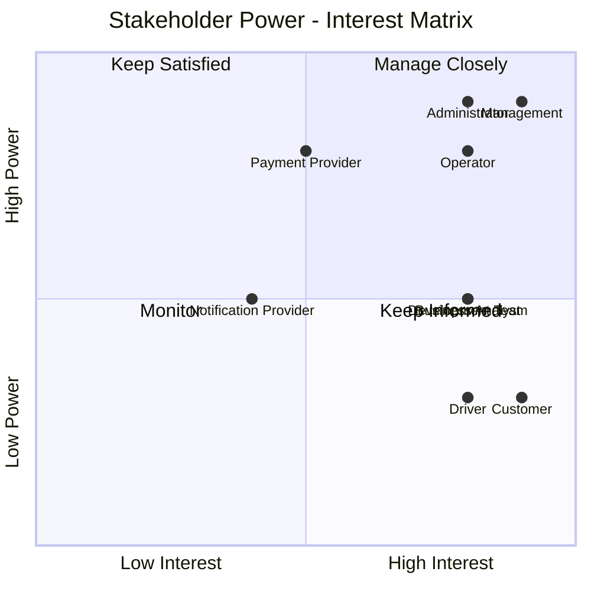

---

## 2.4. Stakeholder Relationship Diagram

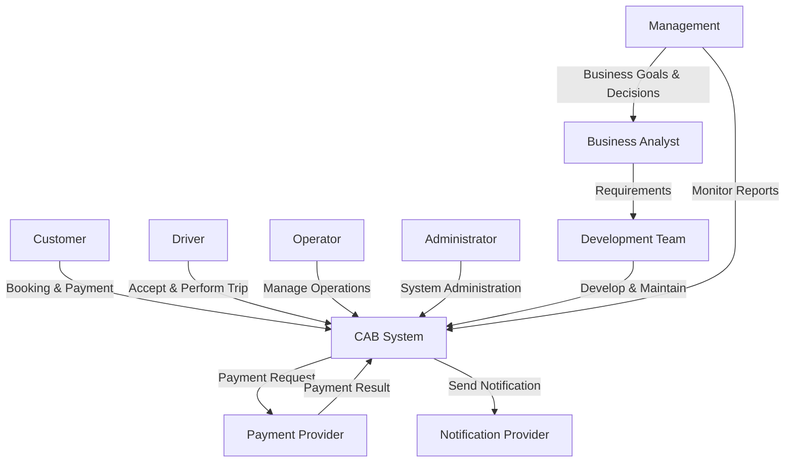

---

## 2.5. Stakeholder Classification

### Primary Stakeholders

Các Stakeholder trực tiếp sử dụng hệ thống:

* Customer
* Driver
* Operator
* Administrator

### Key Stakeholders

Các Stakeholder có ảnh hưởng lớn đến dự án:

* Management
* Business Analyst
* Development Team

### External Stakeholders

Các bên cung cấp dịch vụ bên ngoài:

* Payment Provider
* Notification Provider

# 4. Business Goals

## 4.1. Business Goal Identification

Dựa trên yêu cầu và kỳ vọng của khách hàng, các mục tiêu nghiệp vụ của dự án CAB System được xác định như sau:

| ID    | Customer Requirement                                                    | Business Goal                                                                   |
| ----- | ----------------------------------------------------------------------- | ------------------------------------------------------------------------------- |
| BG-01 | Hệ thống hiện tại phân công tài xế chủ yếu thủ công.                    | Tự động hóa quá trình tìm kiếm và phân công tài xế phù hợp.                     |
| BG-02 | Khách hàng khó theo dõi trạng thái chuyến đi.                           | Nâng cao khả năng theo dõi và quản lý trạng thái chuyến đi theo thời gian thực. |
| BG-03 | Thông tin thanh toán chưa được quản lý tập trung.                       | Xây dựng cơ chế tính cước và quản lý thanh toán tập trung, an toàn.             |
| BG-04 | Bộ phận vận hành gặp khó khăn trong việc quản lý và mở rộng hệ thống.   | Nâng cao hiệu quả quản lý và vận hành hoạt động đặt xe.                         |
| BG-05 | Hệ thống cần phục vụ số lượng lớn khách hàng và tài xế.                 | Xây dựng hệ thống có khả năng mở rộng và đáp ứng nhu cầu tăng trưởng.           |
| BG-06 | Khách hàng và tài xế cần được thông báo về các sự kiện quan trọng.      | Cung cấp cơ chế thông báo kịp thời trong quá trình sử dụng dịch vụ.             |
| BG-07 | Ban lãnh đạo cần theo dõi số chuyến, doanh thu và hiệu quả tài xế.      | Cung cấp dữ liệu và báo cáo hỗ trợ quản lý và ra quyết định.                    |
| BG-08 | Dữ liệu cá nhân, vị trí và giao dịch cần được bảo vệ.                   | Đảm bảo an toàn và bảo mật thông tin trong hệ thống.                            |
| BG-09 | Các chức năng quản trị cần được kiểm soát quyền truy cập.               | Đảm bảo kiểm soát và phân quyền phù hợp cho người dùng hệ thống.                |
| BG-10 | Hệ thống cần có khả năng phát triển thêm các tính năng trong tương lai. | Xây dựng nền tảng linh hoạt, dễ bảo trì và hỗ trợ mở rộng trong tương lai.      |

---

## 4.2. Detailed Business Goals

### BG-01: Automate Driver Matching and Assignment

Tự động hóa quá trình tìm kiếm, lựa chọn và phân công tài xế phù hợp nhằm giảm sự phụ thuộc vào việc điều phối thủ công và nâng cao hiệu quả phục vụ khách hàng.

---

### BG-02: Improve Trip Visibility

Cung cấp khả năng theo dõi trạng thái chuyến đi và thông tin liên quan, giúp khách hàng và bộ phận vận hành dễ dàng kiểm soát quá trình thực hiện chuyến đi.

---

### BG-03: Centralize Fare and Payment Management

Xây dựng cơ chế tính cước và quản lý thanh toán tập trung, hỗ trợ nhiều phương thức thanh toán và đảm bảo an toàn thông tin giao dịch.

---

### BG-04: Improve Operational Efficiency

Cung cấp công cụ hỗ trợ bộ phận vận hành quản lý khách hàng, tài xế, phương tiện và chuyến đi, từ đó nâng cao hiệu quả hoạt động của doanh nghiệp.

---

### BG-05: Support System Scalability

Xây dựng hệ thống có khả năng đáp ứng số lượng lớn khách hàng và tài xế, đồng thời cho phép các thành phần được mở rộng khi nhu cầu sử dụng tăng.

---

### BG-06: Provide Timely Notifications

Cung cấp cơ chế thông báo kịp thời cho khách hàng và tài xế về các sự kiện quan trọng trong quá trình đặt và thực hiện chuyến đi.

---

### BG-07: Support Business Monitoring and Decision Making

Cung cấp các báo cáo và dữ liệu cần thiết về hoạt động kinh doanh, doanh thu, chuyến đi và hiệu quả tài xế nhằm hỗ trợ ban lãnh đạo theo dõi và ra quyết định.

---

### BG-08: Ensure Data Security

Đảm bảo thông tin cá nhân, dữ liệu vị trí và dữ liệu giao dịch được bảo vệ, đồng thời hạn chế các rủi ro liên quan đến bảo mật thông tin.

---

### BG-09: Ensure Access Control

Thiết lập cơ chế phân quyền phù hợp nhằm đảm bảo người dùng chỉ có thể truy cập và thực hiện các chức năng được cho phép.

---

### BG-10: Enable Future System Expansion

Xây dựng nền tảng có kiến trúc linh hoạt, cho phép bổ sung dịch vụ, phương thức thanh toán, nhà cung cấp thông báo và các chức năng mới mà không cần xây dựng lại toàn bộ hệ thống.

---

## 4.3. Business Goal Hierarchy

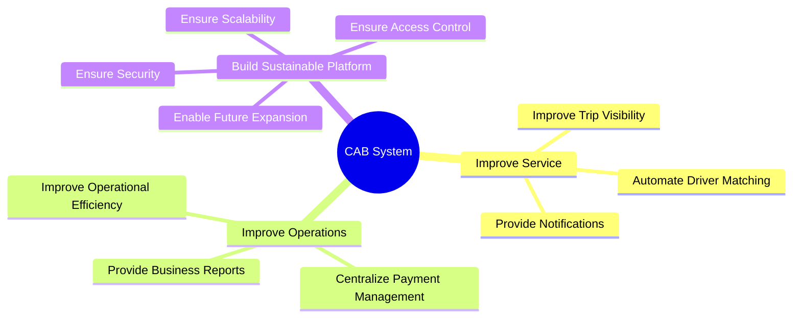
# 5. Project Scope

## 5.1. Scope Identification

Dựa trên các Business Goals đã xác định, phạm vi dự án được giới hạn dựa trên:

* Thời gian phát triển dự án: **7 tuần**.
* Mục tiêu xây dựng phiên bản MVP.
* Ưu tiên các chức năng cốt lõi của hệ thống đặt xe.
* Các module phải trực tiếp hỗ trợ Business Goals.
* Các chức năng nâng cao sẽ được phát triển trong các giai đoạn sau.

Quy trình cốt lõi của CAB System:

```text
Account
   ↓
Booking
   ↓
Driver Matching
   ↓
Trip Management
   ↓
Fare Calculation
   ↓
Payment
   ↓
Notification
   ↓
Rating
```

---

## 5.2. Business Goals to Modules Mapping

| Business Goal                                          | Module đề xuất                                                                   |
| ------------------------------------------------------ | -------------------------------------------------------------------------------- |
| BG-01: Automate Driver Matching and Assignment         | Booking Management, Driver Matching                                              |
| BG-02: Improve Trip Visibility                         | Trip Management, Location Tracking                                               |
| BG-03: Centralize Fare and Payment Management          | Fare Calculation, Payment Management                                             |
| BG-04: Improve Operational Efficiency                  | Customer Management, Driver Management, Vehicle Management, Operation Management |
| BG-05: Support System Scalability                      | System Architecture, Module-based Design                                         |
| BG-06: Provide Timely Notifications                    | Notification Management                                                          |
| BG-07: Support Business Monitoring and Decision Making | Basic Reporting                                                                  |
| BG-08: Ensure Data Security                            | Authentication, Authorization                                                    |
| BG-09: Ensure Access Control                           | Authorization, Role Management                                                   |
| BG-10: Enable Future System Expansion                  | Modular Architecture, Integration Design                                         |

---

# 5.3. In Scope – MVP Modules

Trong phạm vi MVP, các module sau sẽ được phát triển.

| ID   | Module                              | Mục đích                                    |
| ---- | ----------------------------------- | ------------------------------------------- |
| M-01 | Authentication & Account Management | Quản lý tài khoản và xác thực người dùng    |
| M-02 | Customer Management                 | Quản lý thông tin khách hàng                |
| M-03 | Driver Management                   | Quản lý thông tin và trạng thái tài xế      |
| M-04 | Vehicle Management                  | Quản lý phương tiện của tài xế              |
| M-05 | Booking Management                  | Tiếp nhận và quản lý yêu cầu đặt xe         |
| M-06 | Driver Matching & Assignment        | Tìm và phân công tài xế phù hợp             |
| M-07 | Trip Management                     | Quản lý quá trình thực hiện chuyến đi       |
| M-08 | Fare Calculation                    | Tính cước chuyến đi                         |
| M-09 | Payment Management                  | Quản lý thanh toán                          |
| M-10 | Notification Management             | Gửi thông báo cho khách hàng và tài xế      |
| M-11 | Operation Management                | Hỗ trợ nhân viên vận hành quản lý hệ thống  |
| M-12 | Authorization & Access Control      | Phân quyền người dùng và kiểm soát truy cập |

---

## 5.4. Module Priority

Do giới hạn thời gian 7 tuần, các module được phân loại theo mức độ ưu tiên.

### P0 – Must Have

Các module bắt buộc phải có để hệ thống có thể vận hành:

| Module                              | Business Goal hỗ trợ |
| ----------------------------------- | -------------------- |
| Authentication & Account Management | BG-08, BG-09         |
| Driver Management                   | BG-01, BG-04         |
| Booking Management                  | BG-01, BG-02         |
| Driver Matching & Assignment        | BG-01                |
| Trip Management                     | BG-02                |
| Fare Calculation                    | BG-03                |
| Payment Management                  | BG-03                |
| Basic Authorization                 | BG-08, BG-09         |

---

### P1 – Should Have

Các module quan trọng nhưng có thể triển khai ở mức cơ bản trong MVP:

| Module                  | Business Goal hỗ trợ |
| ----------------------- | -------------------- |
| Customer Management     | BG-04                |
| Vehicle Management      | BG-04                |
| Notification Management | BG-06                |
| Operation Management    | BG-04                |
| Location Tracking       | BG-02                |

---

### P2 – Could Have

Các module có giá trị bổ sung nhưng không ảnh hưởng trực tiếp đến khả năng vận hành cơ bản của hệ thống:

| Module                        | Business Goal hỗ trợ    |
| ----------------------------- | ----------------------- |
| Rating & Review               | Improve Service Quality |
| Basic Reporting               | BG-07                   |
| Driver Performance Statistics | BG-07                   |
| Audit Log                     | BG-08                   |

---

# 5.5. Module Scope Diagram

```mermaid
flowchart TB

    CAB[CAB System]

    CAB --> CORE[Core Modules - P0]
    CAB --> HIGH[Important Modules - P1]
    CAB --> OPTIONAL[Optional Modules - P2]

    CORE --> A[Authentication & Account]
    CORE --> B[Driver Management]
    CORE --> C[Booking Management]
    CORE --> D[Driver Matching]
    CORE --> E[Trip Management]
    CORE --> F[Fare Calculation]
    CORE --> G[Payment Management]
    CORE --> H[Authorization]

    HIGH --> I[Customer Management]
    HIGH --> J[Vehicle Management]
    HIGH --> K[Notification]
    HIGH --> L[Operation Management]
    HIGH --> M[Location Tracking]

    OPTIONAL --> N[Rating & Review]
    OPTIONAL --> O[Basic Reporting]
    OPTIONAL --> P[Driver Statistics]
    OPTIONAL --> Q[Audit Log]
```

---

# 5.6. Core Business Flow

Các module trong MVP tập trung hỗ trợ quy trình nghiệp vụ chính:

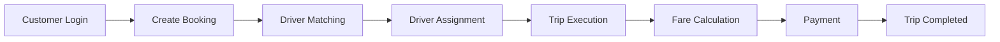

Các module hỗ trợ:

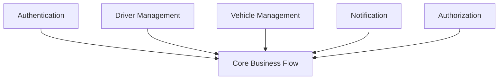

---

# 5.7. Out of Scope

Các chức năng sau không thuộc phạm vi MVP do giới hạn thời gian và nguồn lực:

### Advanced Features

* AI Driver Matching.
* Machine Learning.
* Predictive Analytics.
* Advanced Driver Ranking.
* Dynamic Pricing.
* Demand Forecasting.

### Customer Experience Features

* Loyalty Program.
* Membership.
* Voucher và Promotion.
* Referral Program.
* Subscription.

### Advanced Booking

* Scheduled Booking.
* Recurring Booking.
* Multi-stop Trip.
* Ride Sharing.

### Advanced Analytics

* Business Intelligence Dashboard.
* Advanced Analytics.
* Real-time Analytics.
* Predictive Reporting.

Các chức năng trên có thể được xem xét phát triển trong các giai đoạn tiếp theo.

---

# 5.8. Scope Boundary

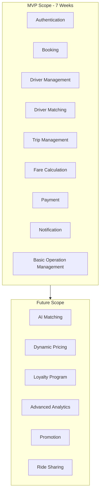

---

# 5.9. Scope Summary

Dự án CAB System trong giai đoạn MVP tập trung vào các chức năng cần thiết để vận hành một hệ thống đặt xe cơ bản.

### Core Modules

* Authentication & Account Management
* Driver Management
* Booking Management
* Driver Matching & Assignment
* Trip Management
* Fare Calculation
* Payment Management

### Supporting Modules

* Vehicle Management
* Notification Management
* Operation Management
* Authorization & Access Control

### Future Modules

* Rating & Review
* Advanced Reporting
* AI Driver Matching
* Dynamic Pricing
* Loyalty Program
* Advanced Analytics
# 6. Business Requirements

## 6.1. Overview

Dựa trên các Business Goals và phạm vi MVP đã xác định, CAB System cần đáp ứng các Business Requirements sau.

Các Business Requirements tập trung vào những nhu cầu nghiệp vụ cốt lõi của doanh nghiệp trong phạm vi dự án 7 tuần.

---

## 6.2. Business Requirements by Module

### BR-01. Account & Authentication

Hệ thống cần hỗ trợ quản lý tài khoản và xác thực người dùng để đảm bảo chỉ những người dùng hợp lệ mới có thể sử dụng các chức năng tương ứng.

**Business Requirements:**

* BR-01.01: Hệ thống phải hỗ trợ các nhóm người dùng chính gồm Customer, Driver và Operator.
* BR-01.02: Người dùng phải được xác thực trước khi sử dụng các chức năng yêu cầu tài khoản.
* BR-01.03: Mỗi nhóm người dùng chỉ được truy cập các chức năng phù hợp với vai trò của mình.
* BR-01.04: Hệ thống phải cho phép người dùng quản lý thông tin tài khoản cơ bản.

---

### BR-02. Driver Management

Hệ thống cần hỗ trợ doanh nghiệp quản lý thông tin và trạng thái hoạt động của tài xế.

**Business Requirements:**

* BR-02.01: Hệ thống phải lưu trữ thông tin cơ bản của tài xế.
* BR-02.02: Hệ thống phải quản lý thông tin phương tiện của tài xế.
* BR-02.03: Tài xế phải có trạng thái hoạt động để xác định khả năng nhận chuyến.
* BR-02.04: Chỉ tài xế đủ điều kiện và đang sẵn sàng mới được tham gia quá trình nhận chuyến.
* BR-02.05: Một tài xế không được thực hiện nhiều chuyến tại cùng một thời điểm.

---

### BR-03. Booking Management

Hệ thống cần cho phép khách hàng tạo và quản lý yêu cầu đặt xe.

**Business Requirements:**

* BR-03.01: Khách hàng phải cung cấp điểm đón và điểm đến khi tạo yêu cầu đặt xe.
* BR-03.02: Khách hàng phải lựa chọn loại dịch vụ hoặc loại xe phù hợp.
* BR-03.03: Mỗi yêu cầu đặt xe phải được hệ thống quản lý theo trạng thái.
* BR-03.04: Khách hàng phải có khả năng theo dõi trạng thái yêu cầu đặt xe.
* BR-03.05: Hệ thống phải thông báo cho khách hàng khi có thay đổi quan trọng liên quan đến yêu cầu đặt xe.

---

### BR-04. Driver Matching & Assignment

Hệ thống cần tự động hỗ trợ quá trình tìm kiếm và phân công tài xế phù hợp cho khách hàng.

**Business Requirements:**

* BR-04.01: Hệ thống phải xác định các tài xế phù hợp với yêu cầu đặt xe.
* BR-04.02: Việc lựa chọn tài xế phải dựa trên trạng thái hoạt động và vị trí của tài xế.
* BR-04.03: Hệ thống nên ưu tiên tài xế phù hợp và gần khách hàng.
* BR-04.04: Tài xế phải có quyền chấp nhận hoặc từ chối yêu cầu chuyến đi.
* BR-04.05: Nếu tài xế từ chối hoặc không phản hồi, hệ thống phải tiếp tục tìm tài xế khác.
* BR-04.06: Khách hàng không phải tạo lại yêu cầu khi hệ thống tìm tài xế khác.
* BR-04.07: Nếu không tìm được tài xế phù hợp, khách hàng phải được thông báo.

---

### BR-05. Trip Management

Hệ thống cần quản lý toàn bộ vòng đời của một chuyến đi.

**Business Requirements:**

* BR-05.01: Mỗi chuyến đi phải được quản lý theo các trạng thái rõ ràng.
* BR-05.02: Tài xế phải cập nhật trạng thái trong quá trình thực hiện chuyến đi.
* BR-05.03: Khách hàng phải có khả năng theo dõi trạng thái hiện tại của chuyến đi.
* BR-05.04: Bộ phận vận hành phải có khả năng theo dõi các chuyến đi đang diễn ra.
* BR-05.05: Hệ thống phải lưu lịch sử chuyến đi sau khi hoàn thành.

---

### BR-06. Fare Calculation

Hệ thống cần hỗ trợ xác định chi phí của chuyến đi.

**Business Requirements:**

* BR-06.01: Hệ thống phải xác định giá cước sau khi chuyến đi hoàn thành.
* BR-06.02: Giá cước phải dựa trên loại dịch vụ và thông tin của chuyến đi.
* BR-06.03: Thông tin giá cước phải được lưu cùng với chuyến đi.
* BR-06.04: Khách hàng phải biết số tiền cần thanh toán.

> Công thức tính giá cước chi tiết sẽ được xác định trong quá trình làm rõ yêu cầu.

---

### BR-07. Payment Management

Hệ thống cần hỗ trợ quản lý thanh toán cho các chuyến đi.

**Business Requirements:**

* BR-07.01: Hệ thống phải hỗ trợ thanh toán bằng tiền mặt.
* BR-07.02: Hệ thống phải hỗ trợ phương thức thanh toán điện tử.
* BR-07.03: Thanh toán điện tử phải được xử lý thông qua nhà cung cấp thanh toán bên ngoài.
* BR-07.04: Hệ thống không được lưu trực tiếp thông tin thanh toán nhạy cảm của khách hàng.
* BR-07.05: Kết quả thanh toán phải được cập nhật vào chuyến đi tương ứng.
* BR-07.06: Khi thanh toán thất bại, khách hàng phải được thông báo và xử lý theo chính sách của doanh nghiệp.

---

### BR-08. Notification Management

Hệ thống cần cung cấp thông báo về các sự kiện quan trọng trong quá trình đặt và thực hiện chuyến đi.

**Business Requirements:**

* BR-08.01: Khách hàng phải nhận được thông báo khi yêu cầu đặt xe được tiếp nhận.
* BR-08.02: Tài xế phải nhận được thông báo khi có yêu cầu chuyến đi phù hợp.
* BR-08.03: Khách hàng phải được thông báo khi tài xế nhận chuyến.
* BR-08.04: Khách hàng phải được thông báo khi tài xế đến điểm đón.
* BR-08.05: Các bên liên quan phải được thông báo khi chuyến đi hoàn thành.
* BR-08.06: Khách hàng phải được thông báo về kết quả thanh toán.

---

### BR-09. Operation Management

Hệ thống cần hỗ trợ bộ phận vận hành quản lý các hoạt động chính của doanh nghiệp.

**Business Requirements:**

* BR-09.01: Nhân viên vận hành phải có khả năng quản lý thông tin khách hàng.
* BR-09.02: Nhân viên vận hành phải có khả năng quản lý tài xế.
* BR-09.03: Nhân viên vận hành phải có khả năng quản lý thông tin phương tiện.
* BR-09.04: Nhân viên vận hành phải có khả năng theo dõi các chuyến đi đang diễn ra.
* BR-09.05: Nhân viên vận hành phải có khả năng tra cứu lịch sử chuyến đi.
* BR-09.06: Nhân viên vận hành phải có khả năng hỗ trợ xử lý các trường hợp phát sinh.

---

### BR-10. Authorization & Access Control

Hệ thống cần kiểm soát quyền truy cập của người dùng.

**Business Requirements:**

* BR-10.01: Hệ thống phải phân quyền dựa trên vai trò của người dùng.
* BR-10.02: Người dùng chỉ được truy cập các chức năng phù hợp với vai trò.
* BR-10.03: Các chức năng quản trị nhạy cảm phải được giới hạn quyền truy cập.
* BR-10.04: Các thao tác quan trọng cần có khả năng truy vết khi cần thiết.

---

## 6.3. Business Requirements Summary

| ID    | Business Requirement                   | Related Module           |
| ----- | -------------------------------------- | ------------------------ |
| BR-01 | Quản lý và xác thực người dùng         | Account & Authentication |
| BR-02 | Quản lý tài xế và trạng thái hoạt động | Driver Management        |
| BR-03 | Quản lý yêu cầu đặt xe                 | Booking Management       |
| BR-04 | Tự động tìm và phân công tài xế        | Driver Matching          |
| BR-05 | Quản lý vòng đời chuyến đi             | Trip Management          |
| BR-06 | Tính giá cước chuyến đi                | Fare Calculation         |
| BR-07 | Quản lý thanh toán                     | Payment Management       |
| BR-08 | Quản lý thông báo                      | Notification Management  |
| BR-09 | Hỗ trợ hoạt động vận hành              | Operation Management     |
| BR-10 | Phân quyền và kiểm soát truy cập       | Authorization            |

---

## 6.4. Business Requirement Relationship

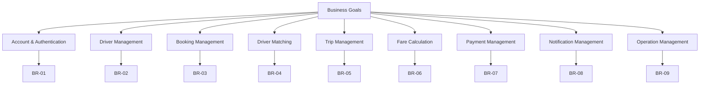
# 7. Business Process Modeling

## 7.1. Overview

Dựa trên các Business Requirements đã xác định, CAB System có các quy trình nghiệp vụ chính sau:

| ID    | Business Process                     | Related Business Requirements |
| ----- | ------------------------------------ | ----------------------------- |
| BP-01 | User & Driver Management             | BR-01, BR-02, BR-10           |
| BP-02 | Ride Booking Process                 | BR-03                         |
| BP-03 | Driver Matching & Assignment Process | BR-04                         |
| BP-04 | Trip Execution Process               | BR-05                         |
| BP-05 | Fare Calculation & Payment Process   | BR-06, BR-07                  |
| BP-06 | Notification Process                 | BR-08                         |
| BP-07 | Operation Management Process         | BR-09                         |

Các quy trình trên liên kết với nhau để tạo thành quy trình nghiệp vụ tổng thể của hệ thống CAB.

---

# 7.2. Overall Business Process

Quy trình nghiệp vụ tổng thể của hệ thống bắt đầu từ khi khách hàng tạo yêu cầu đặt xe và kết thúc khi chuyến đi được thanh toán và hoàn thành.

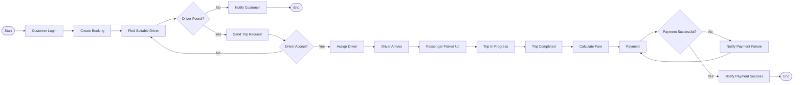

---

# 7.3. BP-01: User & Driver Management Process

**Objective:**
Quản lý tài khoản, thông tin người dùng và trạng thái hoạt động của tài xế.

**Actors:**

* Customer
* Driver
* Operator
* Administrator

### Process Flow

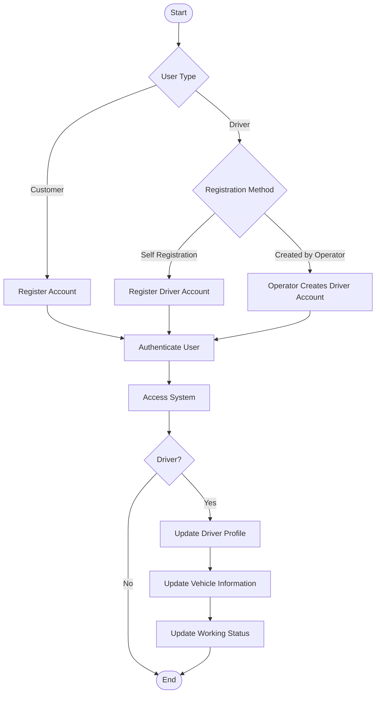

### Business Rules Applied

* User phải được xác thực trước khi sử dụng hệ thống.
* Driver phải có trạng thái hoạt động.
* Chỉ Driver đang sẵn sàng mới có thể nhận chuyến.
* Quyền truy cập phụ thuộc vào vai trò người dùng.

---

# 7.4. BP-02: Ride Booking Process

**Objective:**
Cho phép khách hàng tạo và theo dõi yêu cầu đặt xe.

**Primary Actor:** Customer

### Process Flow


### Business Rules Applied

* Customer phải cung cấp điểm đón.
* Customer phải cung cấp điểm đến.
* Customer phải chọn loại xe.
* Booking phải được quản lý theo trạng thái.

---

# 7.5. BP-03: Driver Matching & Assignment Process

**Objective:**
Tự động tìm và phân công Driver phù hợp cho Booking.

**Actors:**

* System
* Driver
* Customer

### Process Flow

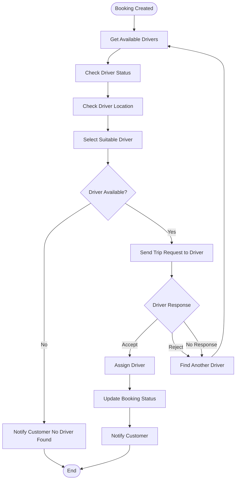

### Business Rules Applied

* Driver phải ở trạng thái Available.
* Driver được ưu tiên dựa trên vị trí và tiêu chí vận hành.
* Driver có quyền Accept hoặc Reject.
* Khi Driver từ chối hoặc không phản hồi, hệ thống tiếp tục tìm Driver khác.
* Customer không cần tạo lại Booking.
* Nếu không tìm được Driver, Customer phải được thông báo.

---

# 7.6. BP-04: Trip Execution Process

**Objective:**
Quản lý quá trình thực hiện chuyến đi từ khi Driver được phân công đến khi chuyến đi hoàn thành.

**Actors:**

* Driver
* Customer
* Operator

### Process Flow

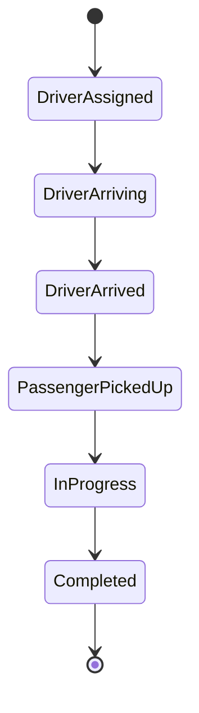

### Trip Status Flow

```text
Driver Assigned
      ↓
Driver Arriving
      ↓
Driver Arrived
      ↓
Passenger Picked Up
      ↓
Trip In Progress
      ↓
Trip Completed
```

### Business Rules Applied

* Mỗi chuyến đi phải có trạng thái rõ ràng.
* Driver chịu trách nhiệm cập nhật trạng thái chuyến.
* Customer có thể theo dõi trạng thái chuyến.
* Operator có thể theo dõi các chuyến đang diễn ra.
* Lịch sử chuyến đi được lưu sau khi hoàn thành.

---

# 7.7. BP-05: Fare Calculation & Payment Process

**Objective:**
Tính cước và xử lý thanh toán sau khi chuyến đi hoàn thành.

**Actors:**

* System
* Customer
* Payment Provider

### Process Flow


### Business Rules Applied

* Giá cước được xác định dựa trên thông tin chuyến đi.
* Hệ thống hỗ trợ Cash và Electronic Payment.
* Thông tin thanh toán nhạy cảm không được lưu trực tiếp.
* Payment điện tử được xử lý bởi Payment Provider.
* Payment Result phải được cập nhật vào chuyến đi.

---

# 7.8. BP-06: Notification Process

**Objective:**
Thông báo cho Customer và Driver về các sự kiện quan trọng.

### Notification Events

| Event            | Recipient        |
| ---------------- | ---------------- |
| Booking Created  | Customer         |
| New Trip Request | Driver           |
| Driver Assigned  | Customer         |
| Driver Arrived   | Customer         |
| Trip Completed   | Customer, Driver |
| Payment Success  | Customer         |
| Payment Failed   | Customer         |
| No Driver Found  | Customer         |

### Process Flow


---

# 7.9. BP-07: Operation Management Process

**Objective:**
Hỗ trợ nhân viên vận hành theo dõi và quản lý hoạt động của hệ thống.

**Primary Actor:** Operator

### Process Flow


### Business Rules Applied

* Operator chỉ được truy cập các chức năng được phân quyền.
* Các thao tác nhạy cảm phải được kiểm soát quyền truy cập.
* Thông tin chuyến đi phải có khả năng tra cứu.
* Các trường hợp lỗi phải được hỗ trợ xử lý.

---

# 7.10. Business Process Relationship

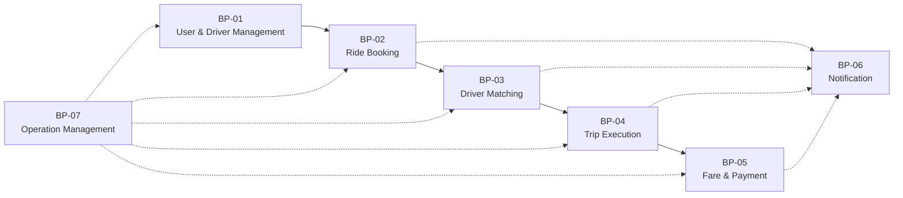

---

# 7.11. Business Process Summary

| ID    | Process                  | Input                | Output             |
| ----- | ------------------------ | -------------------- | ------------------ |
| BP-01 | User & Driver Management | User Information     | Valid User Account |
| BP-02 | Ride Booking             | Pickup & Destination | Booking Request    |
| BP-03 | Driver Matching          | Booking Request      | Assigned Driver    |
| BP-04 | Trip Execution           | Assigned Driver      | Completed Trip     |
| BP-05 | Fare & Payment           | Completed Trip       | Payment Result     |
| BP-06 | Notification             | Business Event       | Notification       |
| BP-07 | Operation Management     | System Data          | Operational Action |

````

## Lưu ý về cấu trúc bài của bạn

Mình thấy thứ tự hiện tại khá logic:

```text
1. Introduction
        ↓
2. Stakeholder Analysis
        ↓
3. Customer Requirements
        ↓
4. Business Goals
        ↓
5. Project Scope & Module Identification
        ↓
6. Business Requirements
        ↓
7. Business Process Modeling
````

Sau Business Process Modeling thì nên làm tiếp:

```text
8. Functional Requirements
        ↓
9. Non-Functional Requirements
        ↓
10. Business Rules
        ↓
11. Use Case Modeling
```

### Một lưu ý quan trọng

Trong bài này, **BP-02 → BP-05 là các Business Process quan trọng nhất**, vì chúng tạo thành core flow:

```text
Create Booking
      ↓
Find Driver
      ↓
Assign Driver
      ↓
Execute Trip
      ↓
Calculate Fare
      ↓
Payment
```

Đây cũng sẽ là quy trình quan trọng nhất để sau này bạn vẽ:

* BPMN Diagram
* Activity Diagram
* Use Case Diagram
* Sequence Diagram

Nếu đây là bài BA chính thức, mình khuyên phần sau nên chuyển sang **BPMN 2.0 có Pool và Lane**, thay vì chỉ dùng Flowchart Mermaid. Như vậy bài sẽ chuyên nghiệp và đúng chuẩn "Business Process Modeling" hơn.


