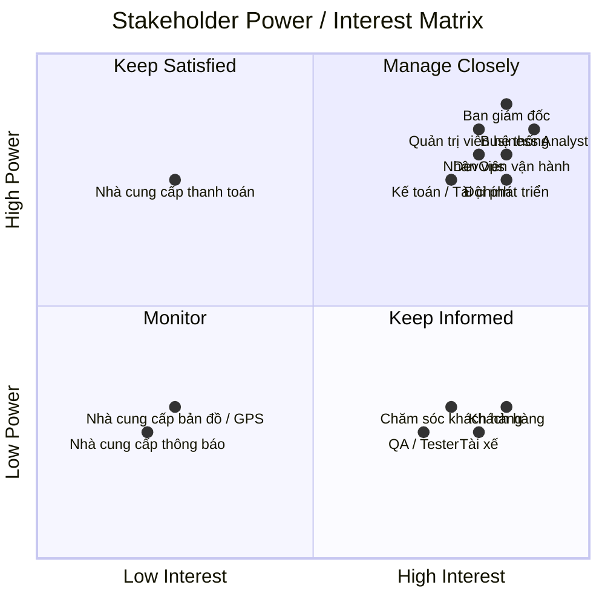
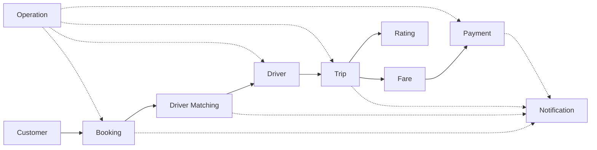

# SRS – CAB System

# 1. Stakeholder Analysis

## 1.1. Mục đích

Stakeholder là các cá nhân, nhóm hoặc tổ chức có ảnh hưởng đến dự án CAB System hoặc chịu ảnh hưởng bởi hoạt động của hệ thống.

Dựa trên yêu cầu của khách hàng, các stakeholder của CAB System được xác định gồm các nhóm nội bộ, bên ngoài và các hệ thống/dịch vụ bên thứ ba.

---

## 1.2. Danh sách Stakeholder và Vai trò

| STT | Stakeholder | Loại | Vai trò |
|---:|---|---|---|
| 1 | Ban giám đốc | Internal | Định hướng dự án, phê duyệt ngân sách, xác định mục tiêu và theo dõi hiệu quả kinh doanh |
| 2 | Khách hàng | External | Đăng ký, đăng nhập, đặt xe, theo dõi chuyến, thanh toán và đánh giá tài xế |
| 3 | Tài xế | External | Cập nhật hồ sơ, trạng thái hoạt động, nhận chuyến, thực hiện chuyến và cập nhật trạng thái |
| 4 | Nhân viên vận hành | Internal | Quản lý khách hàng, tài xế, phương tiện, chuyến đi và xử lý các trường hợp bất thường |
| 5 | Quản trị viên hệ thống | Internal | Quản lý tài khoản, phân quyền, cấu hình, bảo mật và giám sát hệ thống |
| 6 | Bộ phận kế toán / tài chính | Internal | Quản lý giao dịch, doanh thu, thanh toán và đối soát tài chính |
| 7 | Bộ phận chăm sóc khách hàng | Internal | Hỗ trợ khách hàng, tiếp nhận khiếu nại và xử lý các vấn đề liên quan đến chuyến đi |
| 8 | Business Analyst | Internal | Thu thập, phân tích, làm rõ, quản lý và xác nhận yêu cầu nghiệp vụ |
| 9 | Đội phát triển phần mềm | Internal | Phân tích kỹ thuật, thiết kế, phát triển, tích hợp và bảo trì hệ thống |
| 10 | QA / Tester | Internal | Xây dựng kế hoạch kiểm thử, kiểm thử chức năng và đảm bảo chất lượng hệ thống |
| 11 | DevOps / System Administrator | Internal | Triển khai, giám sát, vận hành, sao lưu và đảm bảo tính ổn định của hệ thống |
| 12 | Nhà cung cấp thanh toán | External | Cung cấp dịch vụ xử lý thanh toán điện tử |
| 13 | Nhà cung cấp bản đồ / GPS | External | Cung cấp dữ liệu vị trí, khoảng cách, định tuyến và hỗ trợ tính ETA |
| 14 | Nhà cung cấp dịch vụ thông báo | External | Cung cấp các kênh gửi Push Notification, SMS hoặc Email |

---

# 2. Stakeholder Matrix

## 2.1. Tiêu chí đánh giá

Stakeholder được phân loại dựa trên hai tiêu chí:

- **Power:** Mức độ ảnh hưởng của stakeholder đến quyết định, phạm vi và kết quả dự án.
- **Interest:** Mức độ quan tâm của stakeholder đối với hệ thống và kết quả dự án.

### Các nhóm Stakeholder

| Nhóm | Power | Interest | Chiến lược |
|---|---|---|---|
| **Manage Closely** | Cao | Cao | Quản lý chặt chẽ, trao đổi thường xuyên và tham gia vào các quyết định quan trọng |
| **Keep Satisfied** | Cao | Thấp | Đảm bảo stakeholder hài lòng và cung cấp thông tin cần thiết |
| **Keep Informed** | Thấp | Cao | Cập nhật thông tin thường xuyên và thu thập phản hồi |
| **Monitor** | Thấp | Thấp | Theo dõi và cập nhật khi cần thiết |

---

## 2.2. Phân loại Stakeholder

| Stakeholder | Power | Interest | Nhóm | Chiến lược |
|---|---|---|---|---|
| Ban giám đốc | Cao | Cao | Manage Closely | Báo cáo tiến độ, rủi ro, chi phí và kết quả dự án |
| Nhân viên vận hành | Cao | Cao | Manage Closely | Tham gia phân tích và xác nhận quy trình nghiệp vụ |
| Quản trị viên hệ thống | Cao | Cao | Manage Closely | Tham gia về phân quyền, bảo mật và vận hành |
| Kế toán / Tài chính | Cao | Cao | Manage Closely | Xác nhận yêu cầu thanh toán, doanh thu và báo cáo |
| Business Analyst | Cao | Cao | Manage Closely | Phân tích, quản lý và xác nhận yêu cầu |
| Đội phát triển phần mềm | Cao | Cao | Manage Closely | Phối hợp thiết kế và triển khai giải pháp |
| DevOps / System Administrator | Cao | Cao | Manage Closely | Phối hợp triển khai, giám sát và đảm bảo hệ thống hoạt động |
| Khách hàng | Thấp | Cao | Keep Informed | Thu thập phản hồi và cập nhật thông tin |
| Tài xế | Thấp | Cao | Keep Informed | Thu thập phản hồi và hướng dẫn sử dụng |
| Chăm sóc khách hàng | Thấp | Cao | Keep Informed | Thu thập vấn đề hỗ trợ và phản hồi từ khách hàng |
| QA / Tester | Thấp | Cao | Keep Informed | Cập nhật yêu cầu và tiêu chí kiểm thử |
| Nhà cung cấp thanh toán | Cao | Thấp | Keep Satisfied | Quản lý tích hợp và đảm bảo dịch vụ ổn định |
| Nhà cung cấp bản đồ / GPS | Thấp | Thấp | Monitor | Theo dõi chất lượng và tính ổn định của dịch vụ |
| Nhà cung cấp thông báo | Thấp | Thấp | Monitor | Theo dõi khả năng gửi thông báo |

---

## 2.3. Stakeholder Power / Interest Matrix



---

# 3. Business Goals

## 3.1. Mục đích

Business Goals được xây dựng dựa trên yêu cầu của khách hàng nhằm xác định các mục tiêu nghiệp vụ chính mà hệ thống CAB System cần đạt được.

Các Business Goals tập trung vào giá trị mà hệ thống mang lại cho doanh nghiệp, khách hàng, tài xế và bộ phận vận hành.

---

## 3.2. Danh sách Business Goals

| Mã | Business Goal | Mô tả |
|---|---|---|
| **BG-01** | Xây dựng nền tảng đặt xe trực tuyến | Xây dựng nền tảng CAB System cho phép khách hàng đặt xe trực tuyến thuận tiện, nhanh chóng và dễ sử dụng |
| **BG-02** | Tự động hóa tìm kiếm và phân công tài xế | Tự động tìm kiếm và phân công tài xế phù hợp dựa trên vị trí, trạng thái sẵn sàng và tiêu chí vận hành |
| **BG-03** | Theo dõi và quản lý chuyến đi | Cho phép khách hàng, tài xế và nhân viên vận hành theo dõi trạng thái chuyến đi rõ ràng và kịp thời |
| **BG-04** | Quản lý tính cước và thanh toán | Cung cấp cơ chế tính cước và thanh toán tập trung, hỗ trợ tiền mặt và thanh toán điện tử |
| **BG-05** | Cải thiện hệ thống thông báo | Cung cấp thông báo kịp thời cho khách hàng và tài xế trong quá trình đặt và thực hiện chuyến |
| **BG-06** | Nâng cao hiệu quả vận hành | Cung cấp công cụ quản trị giúp nhân viên vận hành quản lý khách hàng, tài xế, phương tiện và chuyến đi |
| **BG-07** | Cung cấp báo cáo và dữ liệu quản lý | Cung cấp dữ liệu về số lượng chuyến, doanh thu, tỷ lệ hoàn thành, tỷ lệ hủy và hiệu quả tài xế |
| **BG-08** | Đảm bảo tính ổn định và khả năng mở rộng | Đảm bảo hệ thống hoạt động ổn định khi nhu cầu tăng cao và có khả năng mở rộng độc lập |
| **BG-09** | Đảm bảo an toàn và bảo mật dữ liệu | Bảo vệ thông tin cá nhân, phương tiện, vị trí và giao dịch, đồng thời kiểm soát quyền truy cập |
| **BG-10** | Xây dựng nền tảng linh hoạt cho tương lai | Cho phép bổ sung dịch vụ, phương thức thanh toán, nhà cung cấp thông báo và thay đổi thành phần kỹ thuật |

---

## 3.3. Chi tiết Business Goals

### BG-01 – Xây dựng nền tảng đặt xe trực tuyến

**Mục tiêu:**

Xây dựng nền tảng CAB System cho phép khách hàng sử dụng dịch vụ đặt xe trực tuyến thuận tiện, nhanh chóng và dễ dàng.

**Yêu cầu liên quan:**

- Khách hàng có thể đăng ký tài khoản.
- Khách hàng có thể đăng nhập.
- Khách hàng có thể cập nhật thông tin cá nhân.
- Khách hàng có thể nhập điểm đón và điểm đến.
- Khách hàng có thể lựa chọn loại xe.
- Khách hàng có thể gửi yêu cầu đặt xe.
- Hệ thống có khả năng phục vụ số lượng lớn khách hàng và tài xế.

---

### BG-02 – Tự động hóa tìm kiếm và phân công tài xế

**Mục tiêu:**

Tự động tìm kiếm và phân công tài xế phù hợp, giảm sự phụ thuộc vào việc phân công thủ công.

**Yêu cầu liên quan:**

- Xác định tài xế phù hợp dựa trên vị trí.
- Kiểm tra trạng thái sẵn sàng của tài xế.
- Ưu tiên tài xế phù hợp và gần khách hàng.
- Tài xế có thể chấp nhận hoặc từ chối chuyến.
- Tiếp tục tìm tài xế khác nếu tài xế không phản hồi hoặc từ chối.
- Không yêu cầu khách hàng tạo lại yêu cầu.
- Thông báo cho khách hàng khi không tìm được tài xế.

---

### BG-03 – Theo dõi và quản lý chuyến đi

**Mục tiêu:**

Cung cấp khả năng theo dõi trạng thái chuyến đi cho khách hàng, tài xế và nhân viên vận hành.

**Yêu cầu liên quan:**

- Khách hàng biết hệ thống đang tìm tài xế.
- Khách hàng biết tài xế đã nhận chuyến.
- Khách hàng biết thời gian dự kiến tài xế đến.
- Tài xế có thể cập nhật trạng thái chuyến.
- Tài xế có thể cập nhật trạng thái đã đến điểm đón.
- Tài xế có thể cập nhật trạng thái đã đón khách.
- Tài xế có thể cập nhật trạng thái đang di chuyển.
- Tài xế có thể cập nhật trạng thái hoàn thành chuyến.
- Nhân viên vận hành có thể theo dõi các chuyến đang diễn ra.
- Hệ thống lưu thông tin vị trí của tài xế.

---

### BG-04 – Quản lý tính cước và thanh toán

**Mục tiêu:**

Xây dựng cơ chế tính cước và thanh toán tập trung, hỗ trợ nhiều phương thức thanh toán và đảm bảo an toàn dữ liệu.

**Yêu cầu liên quan:**

- Tính số tiền khách hàng phải trả sau khi hoàn thành chuyến.
- Hỗ trợ thanh toán bằng tiền mặt.
- Hỗ trợ thanh toán điện tử.
- Tích hợp với nhà cung cấp thanh toán bên ngoài.
- Không lưu trực tiếp thông tin nhạy cảm của thẻ hoặc tài khoản thanh toán.
- Thông báo khi giao dịch thanh toán thành công.
- Thông báo khi giao dịch thanh toán thất bại.
- Cho phép xử lý lại thanh toán theo chính sách doanh nghiệp.

---

### BG-05 – Cải thiện hệ thống thông báo

**Mục tiêu:**

Đảm bảo khách hàng và tài xế nhận được thông tin kịp thời về các sự kiện quan trọng.

**Yêu cầu liên quan:**

- Thông báo khi yêu cầu đặt xe được tiếp nhận.
- Thông báo khi tài xế nhận chuyến.
- Thông báo khi tài xế đến điểm đón.
- Thông báo khi chuyến hoàn thành.
- Thông báo khi thanh toán có kết quả.
- Tài xế nhận thông báo về chuyến mới.
- Tài xế nhận thông báo khi chuyến có thay đổi.
- Có khả năng mở rộng thêm các kênh thông báo trong tương lai.

---

### BG-06 – Nâng cao hiệu quả vận hành

**Mục tiêu:**

Cung cấp giao diện và công cụ quản trị giúp nhân viên vận hành quản lý tập trung các hoạt động của hệ thống CAB.

**Yêu cầu liên quan:**

- Quản lý khách hàng.
- Quản lý tài xế.
- Quản lý phương tiện.
- Theo dõi các chuyến đang diễn ra.
- Kiểm tra trạng thái tài xế.
- Xử lý các trường hợp chuyến bị lỗi.
- Tra cứu lịch sử giao dịch.
- Phân quyền các chức năng quản trị.

---

### BG-07 – Cung cấp báo cáo và dữ liệu quản lý

**Mục tiêu:**

Cung cấp dữ liệu và báo cáo giúp ban lãnh đạo đánh giá hiệu quả kinh doanh và hoạt động vận hành.

**Yêu cầu liên quan:**

- Báo cáo số lượng chuyến.
- Báo cáo doanh thu.
- Báo cáo tỷ lệ chuyến hoàn thành.
- Báo cáo tỷ lệ chuyến hủy.
- Báo cáo hiệu quả hoạt động của tài xế.
- Cung cấp dữ liệu phục vụ việc ra quyết định.

---

### BG-08 – Đảm bảo tính ổn định và khả năng mở rộng

**Mục tiêu:**

Đảm bảo CAB System hoạt động ổn định trong thời điểm nhu cầu tăng cao và có khả năng mở rộng khi số lượng người dùng và giao dịch tăng.

**Yêu cầu liên quan:**

- Hệ thống hoạt động ổn định khi nhu cầu tăng cao.
- Lỗi thanh toán không làm toàn bộ hệ thống đặt xe ngừng hoạt động.
- Lỗi thông báo không làm toàn bộ hệ thống đặt xe ngừng hoạt động.
- Các thành phần có khả năng mở rộng độc lập.
- Chức năng mới có thể được triển khai từng phần.
- Hạn chế ảnh hưởng đến các chức năng đang hoạt động.

---

### BG-09 – Đảm bảo an toàn và bảo mật dữ liệu

**Mục tiêu:**

Đảm bảo thông tin người dùng, dữ liệu vị trí, thông tin phương tiện và dữ liệu giao dịch được bảo vệ.

**Yêu cầu liên quan:**

- Khách hàng phải được xác thực trước khi sử dụng chức năng yêu cầu tài khoản.
- Tài xế phải được xác thực trước khi sử dụng chức năng yêu cầu tài khoản.
- Chức năng quản trị phải được kiểm soát quyền truy cập.
- Bảo vệ thông tin cá nhân.
- Bảo vệ thông tin phương tiện.
- Bảo vệ dữ liệu vị trí.
- Bảo vệ dữ liệu giao dịch.
- Lưu vết các thao tác quan trọng.

---

### BG-10 – Xây dựng nền tảng linh hoạt cho tương lai

**Mục tiêu:**

Xây dựng hệ thống có kiến trúc linh hoạt để doanh nghiệp có thể mở rộng dịch vụ và thay đổi các thành phần kỹ thuật mà không phải xây dựng lại toàn bộ ứng dụng.

**Yêu cầu liên quan:**

- Có thể bổ sung loại dịch vụ mới.
- Có thể thêm phương thức thanh toán.
- Có thể thêm nhà cung cấp thông báo.
- Có thể thay đổi một số thành phần kỹ thuật.
- Hạn chế việc phải xây dựng lại toàn bộ ứng dụng.
- Hỗ trợ phát triển hệ thống lâu dài.

---

# 4. Business Goal Relationship

Sơ đồ dưới đây thể hiện mối quan hệ giữa hệ thống CAB System và các mục tiêu nghiệp vụ.



---

# 5. Các vấn đề cần xác nhận với khách hàng

Trong quá trình phân tích, một số yêu cầu chưa được khách hàng xác định cụ thể. Các vấn đề này cần được Business Analyst làm rõ với các bên liên quan trước khi triển khai.

| Mã | Vấn đề cần xác nhận | Stakeholder liên quan |
|---|---|---|
| **Q-01** | Công thức tính cước cụ thể là gì? | Ban giám đốc, Kế toán / Tài chính, Vận hành |
| **Q-02** | Tiêu chí ưu tiên và lựa chọn tài xế là gì? | Ban giám đốc, Vận hành, Tài xế |
| **Q-03** | Tài xế có bao nhiêu thời gian để phản hồi yêu cầu chuyến? | Vận hành, Tài xế |
| **Q-04** | Chính sách hủy chuyến của khách hàng và tài xế như thế nào? | Ban giám đốc, Vận hành, CSKH |
| **Q-05** | Xử lý như thế nào khi khách hàng hoặc tài xế mất kết nối mạng? | Vận hành, Đội phát triển, DevOps |
| **Q-06** | Dữ liệu khách hàng, tài xế, vị trí và giao dịch được lưu trữ trong bao lâu? | Ban giám đốc, Quản trị viên, Kế toán |
| **Q-07** | Những chức năng quản trị nào cần phân quyền đặc biệt? | Ban giám đốc, Quản trị viên |
| **Q-08** | Những phương thức thanh toán điện tử nào được hỗ trợ? | Kế toán / Tài chính, Nhà cung cấp thanh toán |
| **Q-09** | Những kênh thông báo nào được sử dụng trong giai đoạn đầu? | Ban giám đốc, CSKH, Đội phát triển |
| **Q-10** | Các KPI và báo cáo cụ thể mà ban lãnh đạo cần là gì? | Ban giám đốc, Kế toán, Vận hành |

---

# 6. Traceability giữa Stakeholder và Business Goals

Bảng dưới đây thể hiện stakeholder chính liên quan đến từng Business Goal.

| Business Goal | Stakeholder chính |
|---|---|
| **BG-01** | Khách hàng, Tài xế, Đội phát triển, Ban giám đốc |
| **BG-02** | Tài xế, Khách hàng, Nhân viên vận hành, Đội phát triển |
| **BG-03** | Khách hàng, Tài xế, Nhân viên vận hành, CSKH |
| **BG-04** | Khách hàng, Kế toán / Tài chính, Nhà cung cấp thanh toán |
| **BG-05** | Khách hàng, Tài xế, CSKH, Nhà cung cấp thông báo |
| **BG-06** | Nhân viên vận hành, Quản trị viên, CSKH |
| **BG-07** | Ban giám đốc, Kế toán / Tài chính, Nhân viên vận hành |
| **BG-08** | Ban giám đốc, Đội phát triển, DevOps |
| **BG-09** | Khách hàng, Tài xế, Quản trị viên, DevOps |
| **BG-10** | Ban giám đốc, Đội phát triển, DevOps, Quản trị viên |

---

# 7. Tổng kết

CAB System hướng đến việc xây dựng một nền tảng đặt xe trực tuyến có khả năng phục vụ khách hàng, tài xế và bộ phận vận hành trên cùng một hệ thống.

Các mục tiêu nghiệp vụ trọng tâm bao gồm:

1. Cung cấp nền tảng đặt xe trực tuyến.
2. Tự động hóa việc tìm kiếm và phân công tài xế.
3. Theo dõi và quản lý toàn bộ vòng đời chuyến đi.
4. Quản lý tính cước và thanh toán.
5. Cung cấp hệ thống thông báo linh hoạt.
6. Nâng cao hiệu quả vận hành.
7. Cung cấp báo cáo phục vụ quản lý.
8. Đảm bảo tính ổn định và khả năng mở rộng.
9. Đảm bảo bảo mật và an toàn dữ liệu.
10. Xây dựng nền tảng có khả năng phát triển lâu dài.
Đúng rồi. **Bước 5 nên là Scope / Project Scope**, tức là sau khi có các **Business Goals (BG)** thì mình xác định trong **7 tuần** sẽ làm những module nào, cái nào làm trong Phase 1, cái nào để Phase sau.

 Với CAB System này, mình đề xuất **MVP trong 7 tuần**, tập trung vào luồng nghiệp vụ cốt lõi:

 > **Đăng nhập → Đặt xe → Tìm tài xế → Nhận chuyến → Thực hiện chuyến → Tính cước → Thanh toán → Hoàn thành**

 Dưới đây là phần Markdown bạn có thể **thêm vào `SRS.md` ngay sau phần Business Goals**:
# 5. Project Scope

## 5.1. Mục đích

Dựa trên các Business Goals đã xác định, dự án CAB System được giới hạn phạm vi phát triển trong thời gian **7 tuần**.

Do thời gian phát triển có giới hạn, hệ thống được tập trung vào các chức năng nghiệp vụ cốt lõi nhằm đảm bảo có thể triển khai được một phiên bản **MVP (Minimum Viable Product)**.

Các chức năng nâng cao và các yêu cầu chưa được xác định rõ sẽ được đưa vào phạm vi phát triển trong các giai đoạn tiếp theo.

---

## 5.2. Phạm vi phát triển trong giai đoạn MVP

### Các module chính

| STT | Module | Mã BG liên quan | Phạm vi |
|---:|---|---|---|
| 1 | Authentication & Account | BG-01, BG-09 | **In Scope** |
| 2 | Customer Management | BG-01, BG-09 | **In Scope** |
| 3 | Driver Management | BG-02, BG-03, BG-09 | **In Scope** |
| 4 | Vehicle Management | BG-06 | **In Scope** |
| 5 | Booking Management | BG-01, BG-02, BG-03 | **In Scope** |
| 6 | Driver Matching & Assignment | BG-02 | **In Scope** |
| 7 | Trip Management | BG-03 | **In Scope** |
| 8 | Driver Location Tracking | BG-02, BG-03 | **In Scope** |
| 9 | Fare Calculation | BG-04 | **In Scope** |
| 10 | Payment Management | BG-04 | **In Scope** |
| 11 | Notification | BG-05 | **In Scope** |
| 12 | Rating & Review | BG-01, BG-03 | **In Scope** |
| 13 | Operation Management | BG-06 | **In Scope** |
| 14 | Basic Reporting | BG-07 | **In Scope** |
| 15 | Authorization & Audit Log | BG-09 | **In Scope** |
| 16 | Scalability & Deployment | BG-08, BG-10 | **In Scope – nền tảng cơ bản** |

---

# 5.3. Chi tiết phạm vi từng module

## 5.3.1. Authentication & Account

### In Scope

- Đăng ký tài khoản khách hàng.
- Đăng nhập.
- Đăng xuất.
- Xác thực người dùng.
- Cập nhật thông tin cá nhân.
- Quản lý trạng thái tài khoản.
- Phân biệt vai trò:
  - Customer
  - Driver
  - Operator
  - Administrator

### Out of Scope

- Đăng nhập bằng mạng xã hội.
- Xác thực sinh trắc học.
- Single Sign-On (SSO).
- Multi-factor Authentication nâng cao.

---

## 5.3.2. Customer Management

### In Scope

- Xem thông tin khách hàng.
- Cập nhật thông tin cá nhân.
- Quản lý trạng thái tài khoản.
- Xem lịch sử chuyến đi.
- Xem thông tin thanh toán của chuyến.
- Đánh giá tài xế sau khi hoàn thành chuyến.

### Out of Scope

- Chương trình khách hàng thân thiết.
- Tích điểm.
- Voucher nâng cao.
- Membership.

---

## 5.3.3. Driver Management

### In Scope

- Đăng ký tài xế hoặc nhân viên vận hành tạo tài khoản.
- Quản lý hồ sơ tài xế.
- Cập nhật thông tin tài xế.
- Cập nhật trạng thái hoạt động.
- Chuyển trạng thái:
  - Online
  - Offline
  - Available
  - Busy
- Nhận yêu cầu chuyến.
- Chấp nhận hoặc từ chối chuyến.

### Out of Scope

- Hệ thống chấm điểm tài xế nâng cao.
- Hệ thống thưởng/phạt tự động.
- Tính hoa hồng phức tạp.

---

## 5.3.4. Vehicle Management

### In Scope

- Thêm phương tiện.
- Cập nhật thông tin phương tiện.
- Xem thông tin phương tiện.
- Liên kết phương tiện với tài xế.
- Quản lý loại xe.

### Out of Scope

- Quản lý bảo dưỡng phương tiện.
- Theo dõi nhiên liệu.
- Quản lý chi phí vận hành phương tiện.

---

## 5.3.5. Booking Management

### In Scope

Khách hàng có thể:

- Nhập điểm đón.
- Nhập điểm đến.
- Lựa chọn loại xe.
- Tạo yêu cầu đặt xe.
- Hủy yêu cầu theo chính sách.
- Xem trạng thái yêu cầu.

Các trạng thái cơ bản:

```text
REQUESTED
    ↓
SEARCHING_DRIVER
    ↓
DRIVER_ASSIGNED
    ↓
DRIVER_ARRIVING
    ↓
DRIVER_ARRIVED
    ↓
PASSENGER_PICKED_UP
    ↓
IN_PROGRESS
    ↓
COMPLETED
```

### Out of Scope

- Đặt xe định kỳ.
- Đặt xe cho nhiều điểm đến.
- Đặt xe nhóm.
- Đặt xe trước trong thời gian dài.

---

## 5.3.6. Driver Matching & Assignment

### In Scope

Hệ thống thực hiện:

1. Nhận yêu cầu đặt xe.
2. Xác định các tài xế phù hợp.
3. Kiểm tra trạng thái tài xế.
4. Xác định vị trí tài xế.
5. Ưu tiên tài xế phù hợp và gần khách hàng.
6. Gửi yêu cầu đến tài xế.
7. Chờ tài xế phản hồi.
8. Nếu tài xế từ chối hoặc không phản hồi:
   - Tìm tài xế tiếp theo.
9. Nếu không tìm được tài xế:
   - Cập nhật trạng thái.
   - Thông báo cho khách hàng.

### Out of Scope

Các thuật toán matching nâng cao như:

- Machine Learning.
- AI prediction.
- Dynamic driver scoring.
- Dự đoán nhu cầu theo khu vực.
- Tối ưu đội xe theo thời gian thực ở quy mô lớn.

---

## 5.3.7. Trip Management

### In Scope

Tài xế có thể cập nhật:

- Đã nhận chuyến.
- Đang đến điểm đón.
- Đã đến điểm đón.
- Đã đón khách.
- Đang di chuyển.
- Hoàn thành chuyến.

Khách hàng có thể xem:

- Trạng thái chuyến.
- Thông tin tài xế.
- Thông tin phương tiện.
- Vị trí tài xế.
- ETA dự kiến.

Nhân viên vận hành có thể:

- Xem chuyến đang diễn ra.
- Xem trạng thái chuyến.
- Hỗ trợ xử lý chuyến lỗi.

---

## 5.3.8. Driver Location Tracking

### In Scope

- Ghi nhận vị trí hiện tại của tài xế.
- Cập nhật vị trí định kỳ.
- Sử dụng vị trí để hỗ trợ tìm tài xế.
- Hiển thị vị trí tài xế cho khách hàng trong quá trình chuyến.
- Hỗ trợ tính ETA.

### Out of Scope

- Lưu lịch sử GPS dài hạn.
- Phân tích hành trình nâng cao.
- Heatmap giao thông.
- Phân tích hành vi lái xe.

---

## 5.3.9. Fare Calculation

### In Scope

Hệ thống có khả năng:

- Xác định loại dịch vụ.
- Tính cước dựa trên thông tin chuyến.
- Xác định số tiền khách hàng phải thanh toán.
- Lưu thông tin cước của chuyến.
- Hiển thị số tiền cần thanh toán.

### Lưu ý

Công thức tính cước cụ thể **chưa được khách hàng xác nhận**, do đó cần được làm rõ trước khi triển khai chính thức.

### Out of Scope

- Dynamic pricing phức tạp.
- Surge pricing theo AI.
- Hệ thống khuyến mãi nâng cao.
- Loyalty pricing.

---

## 5.3.10. Payment Management

### In Scope

Hỗ trợ:

- Thanh toán tiền mặt.
- Thanh toán điện tử.
- Tích hợp với payment gateway bên ngoài.
- Nhận kết quả giao dịch.
- Cập nhật trạng thái thanh toán.
- Thông báo thanh toán thành công/thất bại.
- Cho phép retry thanh toán theo chính sách.

Hệ thống **không lưu trực tiếp thông tin nhạy cảm của thẻ hoặc tài khoản thanh toán**.

### Out of Scope

- Tự xây dựng payment gateway.
- Lưu thông tin thẻ ngân hàng.
- Tích hợp nhiều payment gateway trong MVP.
- Hệ thống ví điện tử riêng của CAB.

---

## 5.3.11. Notification

### In Scope

Hệ thống hỗ trợ thông báo các sự kiện chính:

| Sự kiện | Customer | Driver | Operator |
|---|:---:|:---:|:---:|
| Yêu cầu đặt xe được tiếp nhận | ✓ | | |
| Có yêu cầu chuyến mới | | ✓ | |
| Tài xế nhận chuyến | ✓ | | |
| Tài xế đến điểm đón | ✓ | | |
| Chuyến hoàn thành | ✓ | ✓ | |
| Thanh toán thành công | ✓ | | |
| Thanh toán thất bại | ✓ | | |
| Chuyến có thay đổi | ✓ | ✓ | |

### Out of Scope

- Omnichannel notification nâng cao.
- Marketing notification.
- Campaign notification.
- Hệ thống notification analytics nâng cao.

---

## 5.3.12. Rating & Review

### In Scope

- Khách hàng đánh giá tài xế sau chuyến.
- Chấm điểm tài xế.
- Nhập nhận xét.
- Lưu đánh giá.
- Hiển thị điểm đánh giá cơ bản của tài xế.

### Out of Scope

- Hệ thống ranking tài xế.
- Phân tích sentiment.
- AI phân tích đánh giá.

---

## 5.3.13. Operation Management

### In Scope

Nhân viên vận hành có thể:

- Quản lý khách hàng.
- Quản lý tài xế.
- Quản lý phương tiện.
- Xem chuyến đang diễn ra.
- Kiểm tra trạng thái tài xế.
- Tra cứu lịch sử chuyến.
- Tra cứu lịch sử giao dịch.
- Hỗ trợ xử lý chuyến bị lỗi.

### Out of Scope

- Tự động điều phối toàn bộ hoạt động vận hành.
- Workforce management nâng cao.
- Quản lý nhân sự.
- Tính lương nhân viên.

---

## 5.3.14. Basic Reporting

### In Scope

Hệ thống cung cấp các báo cáo cơ bản:

- Tổng số chuyến.
- Số chuyến hoàn thành.
- Số chuyến hủy.
- Tỷ lệ hoàn thành.
- Tỷ lệ hủy.
- Doanh thu.
- Số lượng tài xế hoạt động.
- Hiệu quả hoạt động cơ bản của tài xế.

### Out of Scope

- Business Intelligence nâng cao.
- Predictive Analytics.
- AI Forecasting.
- Data Warehouse hoàn chỉnh.

---

## 5.3.15. Authorization & Audit Log

### In Scope

- Phân quyền theo vai trò.
- Kiểm soát chức năng quản trị.
- Phân biệt quyền Operator và Administrator.
- Ghi log các thao tác quan trọng.
- Lưu thời gian, người thực hiện và hành động.

### Out of Scope

- SIEM hoàn chỉnh.
- Security Operation Center.
- Threat Intelligence.
- Advanced Security Analytics.

---

# 5.4. Scope Matrix

| Module | MVP 7 tuần | Phase 2 | Ghi chú |
|---|:---:|:---:|---|
| Authentication & Account | ✓ | | Chức năng bắt buộc |
| Customer Management | ✓ | | Chức năng bắt buộc |
| Driver Management | ✓ | | Chức năng bắt buộc |
| Vehicle Management | ✓ | | Chức năng bắt buộc |
| Booking Management | ✓ | | Core Business |
| Driver Matching | ✓ | | Core Business |
| Trip Management | ✓ | | Core Business |
| Location Tracking | ✓ | | Cần cho matching và ETA |
| Fare Calculation | ✓ | | Công thức cần xác nhận |
| Payment | ✓ | | Tích hợp payment gateway |
| Notification | ✓ | | Chỉ các notification quan trọng |
| Rating & Review | ✓ | | Chức năng sau chuyến |
| Operation Management | ✓ | | Chức năng quản trị cốt lõi |
| Basic Reporting | ✓ | | Chỉ báo cáo cơ bản |
| Authorization | ✓ | | Bắt buộc về bảo mật |
| Audit Log | ✓ | | Bắt buộc về kiểm soát |
| Advanced Analytics | | ✓ | Phát triển sau MVP |
| Loyalty / Membership | | ✓ | Chưa cần cho MVP |
| Voucher / Promotion | | ✓ | Chưa cần cho MVP |
| Advanced Driver Ranking | | ✓ | Chưa cần cho MVP |
| AI Driver Matching | | ✓ | Chưa cần cho MVP |
| Predictive Analytics | | ✓ | Chưa cần cho MVP |
| Multiple Payment Gateway | | ✓ | Có thể mở rộng sau |
| Advanced Notification | | ✓ | Có thể mở rộng sau |

---

# 5.5. In Scope

Trong phạm vi MVP 7 tuần, hệ thống tập trung vào **core booking flow**:



### Core Flow

```text
Customer
   ↓
Create Booking
   ↓
Search Driver
   ↓
Assign Driver
   ↓
Driver Accept
   ↓
Driver Arrive
   ↓
Pick Up Customer
   ↓
Trip In Progress
   ↓
Complete Trip
   ↓
Calculate Fare
   ↓
Payment
   ↓
Rating
```

---

# 5.6. Out of Scope

Các chức năng sau **không thuộc phạm vi MVP 7 tuần**:

- Loyalty Program.
- Membership.
- Voucher và Promotion nâng cao.
- Đặt xe định kỳ.
- Đặt xe nhiều điểm.
- AI Driver Matching.
- Machine Learning.
- Predictive Analytics.
- Dynamic Pricing nâng cao.
- Advanced Driver Ranking.
- Marketing Campaign.
- Advanced Notification Analytics.
- Data Warehouse.
- Business Intelligence nâng cao.
- Quản lý bảo dưỡng phương tiện.
- Quản lý nhiên liệu.
- Workforce Management.
- Tích hợp nhiều Payment Gateway trong cùng MVP.

Các chức năng này có thể được xem xét trong **Phase 2** sau khi MVP được triển khai và đánh giá.

---

# 5.7. Phạm vi theo Business Goals

| Business Goal | Module chính | MVP |
|---|---|:---:|
| **BG-01** | Authentication, Customer, Booking | ✓ |
| **BG-02** | Driver, Driver Matching, Location Tracking | ✓ |
| **BG-03** | Trip Management, Location Tracking | ✓ |
| **BG-04** | Fare Calculation, Payment | ✓ |
| **BG-05** | Notification | ✓ |
| **BG-06** | Operation Management, Vehicle Management | ✓ |
| **BG-07** | Basic Reporting | ✓ |
| **BG-08** | Scalability, Deployment | ✓ |
| **BG-09** | Authentication, Authorization, Audit Log | ✓ |
| **BG-10** | Modular Architecture, API Integration | ✓ |

---

# 5.8. Ưu tiên phát triển

Các module được ưu tiên dựa trên mức độ quan trọng đối với hoạt động kinh doanh.

| Priority | Module | Lý do |
|---|---|---|
| **P0 – Critical** | Authentication | Người dùng cần xác thực để sử dụng hệ thống |
| **P0 – Critical** | Booking | Chức năng cốt lõi của CAB System |
| **P0 – Critical** | Driver Matching | Đảm bảo yêu cầu đặt xe được xử lý |
| **P0 – Critical** | Trip Management | Quản lý toàn bộ vòng đời chuyến |
| **P0 – Critical** | Driver Management | Cần thiết để vận hành đội tài xế |
| **P0 – Critical** | Fare Calculation | Xác định số tiền khách hàng phải trả |
| **P0 – Critical** | Payment | Hoàn tất quy trình giao dịch |
| **P1 – High** | Location Tracking | Hỗ trợ matching và ETA |
| **P1 – High** | Notification | Đảm bảo người dùng nhận được thông tin |
| **P1 – High** | Operation Management | Hỗ trợ nhân viên vận hành |
| **P1 – High** | Authorization | Đảm bảo bảo mật và phân quyền |
| **P1 – High** | Audit Log | Hỗ trợ kiểm tra và xử lý sự cố |
| **P2 – Medium** | Rating & Review | Tăng chất lượng dịch vụ |
| **P2 – Medium** | Basic Reporting | Hỗ trợ quản lý |
| **P3 – Future** | AI Matching | Có thể phát triển sau MVP |
| **P3 – Future** | Loyalty / Promotion | Không ảnh hưởng đến core booking flow |
| **P3 – Future** | Advanced Analytics | Phát triển khi có đủ dữ liệu |

---

# 5.9. Kết luận về Scope

Trong thời gian **7 tuần**, CAB System sẽ ưu tiên triển khai các chức năng trực tiếp phục vụ quy trình nghiệp vụ cốt lõi:

> **Đăng nhập → Đặt xe → Tìm tài xế → Phân công → Thực hiện chuyến → Tính cước → Thanh toán → Đánh giá**

Các chức năng nâng cao như AI, Loyalty, Promotion, Predictive Analytics và Business Intelligence sẽ được đưa ra khỏi phạm vi MVP để đảm bảo dự án có thể hoàn thành đúng thời hạn.

Việc giới hạn phạm vi giúp nhóm phát triển:

- Tập trung vào các Business Goals quan trọng nhất.
- Giảm rủi ro trong thời gian phát triển 7 tuần.
- Đảm bảo hoàn thành các chức năng cốt lõi.
- Có thể triển khai MVP sớm.
- Tạo nền tảng để phát triển các chức năng nâng cao trong Phase 2.

```mermaid
flowchart TB

    CAB["CAB SYSTEM"]

    BG01["BG-01<br/>Nền tảng đặt xe trực tuyến"]
    BG02["BG-02<br/>Tự động tìm và phân công tài xế"]
    BG03["BG-03<br/>Theo dõi và quản lý chuyến"]
    BG04["BG-04<br/>Tính cước và thanh toán"]
    BG05["BG-05<br/>Hệ thống thông báo"]
    BG06["BG-06<br/>Nâng cao hiệu quả vận hành"]
    BG07["BG-07<br/>Báo cáo và dữ liệu quản lý"]
    BG08["BG-08<br/>Ổn định và khả năng mở rộng"]
    BG09["BG-09<br/>An toàn và bảo mật dữ liệu"]
    BG10["BG-10<br/>Linh hoạt phát triển tương lai"]

    CAB --> BG01
    CAB --> BG02
    CAB --> BG03
    CAB --> BG04
    CAB --> BG05
    CAB --> BG06
    CAB --> BG07
    CAB --> BG08
    CAB --> BG09
    CAB --> BG10

    classDef system fill:#2563eb,color:#ffffff,stroke:#1e3a8a,stroke-width:3px;
    classDef goal fill:#dcfce7,color:#166534,stroke:#22c55e,stroke-width:2px;

    class CAB system;
    class BG01,BG02,BG03,BG04,BG05,BG06,BG07,BG08,BG09,BG10 goal;
```

````


