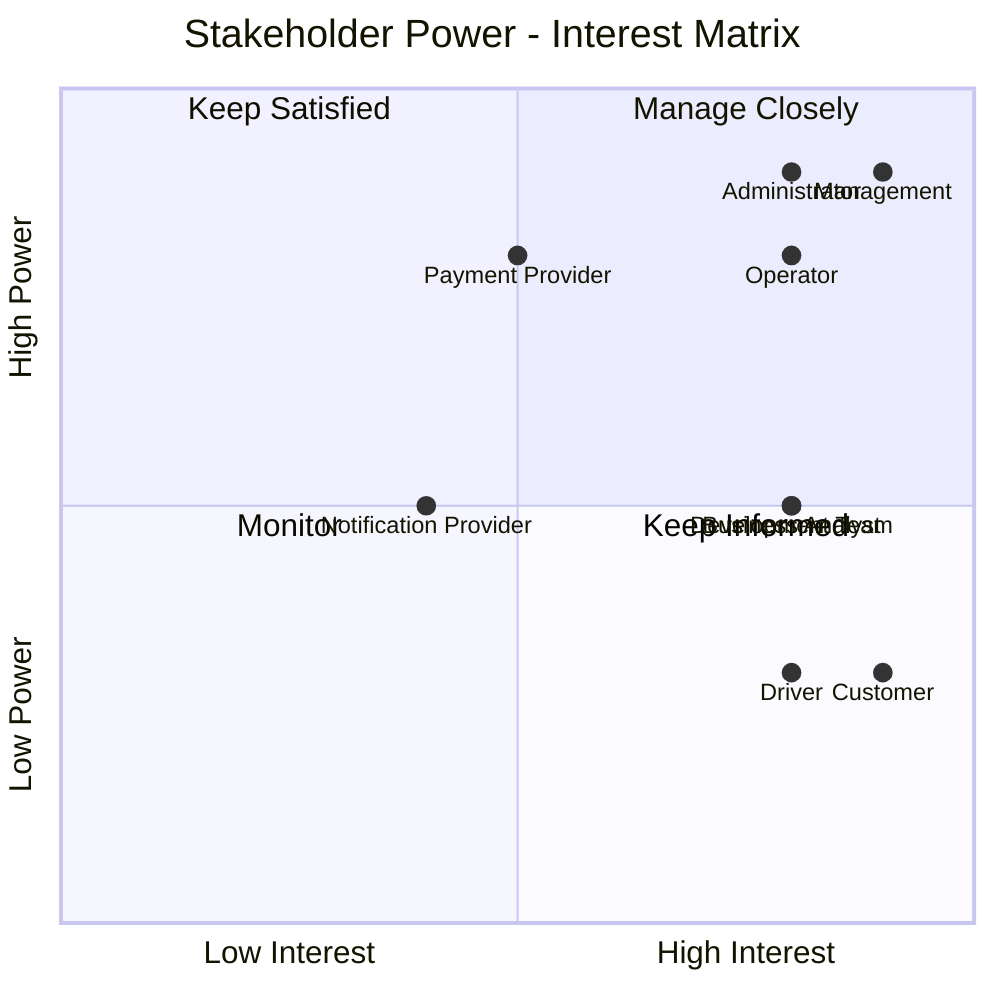
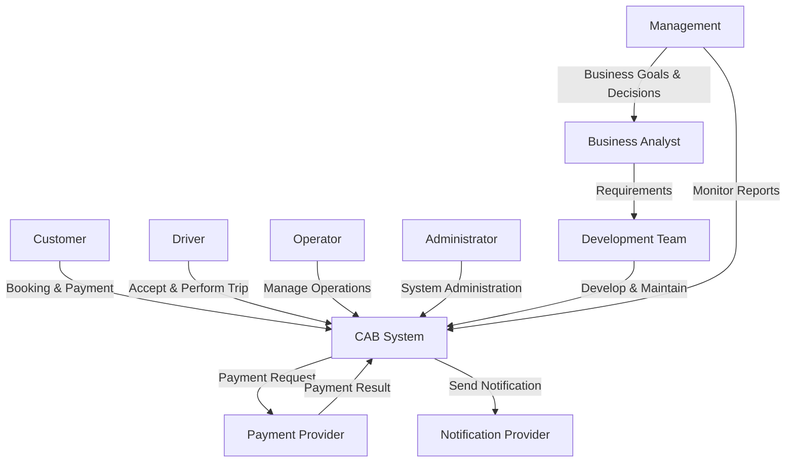

# 2. Stakeholder Analysis

## 2.1. Identified Stakeholders

Các bên liên quan (Stakeholders) của hệ thống CAB được xác định như sau:

| Stakeholder                   | Vai trò                                                                                                |
| ----------------------------- | ------------------------------------------------------------------------------------------------------ |
| Customer (Khách hàng)         | Sử dụng hệ thống để đặt xe, theo dõi chuyến đi, thanh toán và đánh giá tài xế.                         |
| Driver (Tài xế)               | Nhận và thực hiện chuyến đi, cập nhật trạng thái hoạt động và vị trí.                                  |
| Operator (Nhân viên vận hành) | Quản lý khách hàng, tài xế, phương tiện và hỗ trợ xử lý các vấn đề phát sinh trong quá trình vận hành. |
| Administrator                 | Quản lý hệ thống, phân quyền người dùng và kiểm soát các chức năng quản trị.                           |
| Management (Ban lãnh đạo)     | Theo dõi hoạt động kinh doanh, doanh thu và các báo cáo về hiệu quả hoạt động của hệ thống.            |
| Payment Provider              | Cung cấp dịch vụ xử lý thanh toán điện tử cho hệ thống.                                                |
| Notification Provider         | Cung cấp dịch vụ gửi thông báo đến khách hàng và tài xế.                                               |
| Development Team              | Phát triển, kiểm thử, triển khai và bảo trì hệ thống CAB.                                              |
| Business Analyst              | Thu thập, phân tích và làm rõ yêu cầu giữa khách hàng và nhóm phát triển.                              |

---

## 2.2. Stakeholder Matrix

Stakeholder Matrix được xây dựng dựa trên hai tiêu chí:

* **Power:** Mức độ ảnh hưởng đến dự án.
* **Interest:** Mức độ quan tâm đến hệ thống.

| Stakeholder           | Power  | Interest | Management Strategy |
| --------------------- | ------ | -------- | ------------------- |
| Management            | High   | High     | Manage Closely      |
| Operator              | High   | High     | Manage Closely      |
| Customer              | Low    | High     | Keep Informed       |
| Driver                | Low    | High     | Keep Informed       |
| Administrator         | High   | High     | Manage Closely      |
| Payment Provider      | High   | Medium   | Keep Satisfied      |
| Notification Provider | Medium | Medium   | Monitor             |
| Development Team      | Medium | High     | Keep Informed       |
| Business Analyst      | Medium | High     | Keep Informed       |

---

## 2.3. Power – Interest Matrix



---

## 2.4. Stakeholder Relationship Diagram



---

## 2.5. Stakeholder Classification

### Primary Stakeholders

Các Stakeholder trực tiếp sử dụng hệ thống:

* Customer
* Driver
* Operator
* Administrator

### Key Stakeholders

Các Stakeholder có ảnh hưởng lớn đến dự án:

* Management
* Business Analyst
* Development Team

### External Stakeholders

Các bên cung cấp dịch vụ bên ngoài:

* Payment Provider
* Notification Provider

```

### Lưu ý

Mình đã chỉnh Stakeholder Matrix theo hướng hợp lý cho bài BA:

- **Customer và Driver**: Power thấp nhưng Interest cao → `Keep Informed`.
- **Management, Administrator, Operator**: Power và Interest cao → `Manage Closely`.
- **Payment Provider**: có ảnh hưởng khá lớn nhưng không trực tiếp quan tâm toàn bộ dự án → `Keep Satisfied`.
- **Notification Provider**: ảnh hưởng và mức quan tâm trung bình → `Monitor`.

Phần này đặt ngay sau **Introduction**, trước **Business Goals** là hợp lý nhất trong file `SRS.md`.
```
